# Previsão de Votação de Deputados

### Sobre a tarefa

Nesta atividade construiremos modelos preditivos de regressão em scikit learn para a predição dos votos de deputados federais considerando as últimas eleições. As atividades esperadas para essa etapa são descritas a seguir:

1. Baixe os dados [aqui](https://canvas.instructure.com/courses/1389733/files/69523670/download?verifier=A5EPvssqIQCjlxpWQyesLFer1VDTlRyTAAXR2iyi&wrap=1) (veja descrição dos dados mais abaixo).
2. Considere o pipeline mostrado nesse [link](https://www.kaggle.com/apapiu/regularized-linear-models) para construir seus modelos de regressão. Isso implica, dentre outras coisas:
    - Analisar as distribuições das variáveis para ver se estão enviesadas e precisam de correção; tratamento de valores ausentes, variáveis categóricas e normalização, quando for o caso.   
    - Construir modelos de regressão com (ridge e lasso) e sem regularização.    
    - Considerar também modelos de regressão não paramétrica como K-NN.    
    - Considerar outros modelos ainda não vistos em sala de sua escolha (e.g. SVR, Regression Trees e Random Florests).    
    - Tunar os hiperâmetros para cada caso e retornar os rmses de validação cruzada para todos os modelos avaliados.    
    - Plotar os resíduos versus predições e analisar se esses plots representam bons indícios da adequabilidade dos modelos a esse problema.    
3. Alguns dias antes da entrega final serão liberados os dados de teste referentes à 2014 para validação final dos seus melhores modelos.
    - Dica: Uma coisa que você pode fazer é usar os dados de 2006 como treino e os de 2010 como validação. Uma vez encontrados os melhores modelos para 2010 junte 2006+2010, retreine, e aplique o modelo aos dados de 2014 que serão liberados.    
4. Responder:
    - Dentre os modelos avaliados, qual foi o que deu o melhor resultado nos dados de 2014 em termos de RMSE? Justifique bem sua resposta.
    
A entrega deve ser um notebook Jupyter com código python e texto explicativo quando necessário. Crie um repositório na sua conta do github e envie o link do html do notebook.

### Sobre os dados

Vamos explorar dados sobre as votações que candidatos à Câmara Federal de Deputados receberam nos anos de 2006 e 2010. Esses dados foram extraídos do [TSE](http://www.tse.jus.br/hotSites/pesquisas-eleitorais/index.html), pré-processados e contemplam informações sobre aproximadamente 7.300 candidatos. A descrição de cada atributo é dada mais abaixo.

|  Variável  | Tipo | Descrição |
|:------------|:------:|:-----------|
|"sequencial_candidato" | (character) | id do candidato|
|"nome"| (character) | |
|"uf" | (character) | |
|"partido" | (character)| |
|"quantidade_doacoes"| (integer)| |
|"quantidade_doadores"| (integer) | número de doadores diferentes|
|"total_receita" | (double) | soma em R\$ das doações |
|"media_receita" | (double) | média das doações |
|"recursos_de_outros_candidatos/comites" | (double) | quantia em R\$ das doações provenientes de outros candidatos ou comite partidário |
|"recursos_de_pessoas_fisicas" | (double) | quantia em R\$ das doações provenientes de outros CPFs |
|"recursos_de_pessoas_juridicas" | (double) | quantia em R\$ das doações provenientes de outros CNPJ |
|"recursos_proprios" | (double) | quantia em R\$ das doações provenientes do próprio candidato |
|"recursos_de_partido_politico" | (double) | quantia em R\$ das doações provenientes do partido político do candidato |
|**"votos"** | (integer) | **variável alvo**. Se refere ao número de votos na campanha de 2006 e 2010 |
|"quantidade_despesas" | (integer) | |
|"quantidade_fornecedores" | (integer) | número de fornecedores/despesas diferentes |
|"total_despesa" | (double) | soma em R$ das despesas de campanha |
|"media_despesa" | (double) | média das despesas de campanha |
|"cargo" |(character) | |
|"Sexo": | (character) | |
|"grau": | (character) | grau de instrução do candidato |
|"estado_civil" | (character) |
|"ocupacao" | (character) | ocupação do candidato |


```python
import pandas as pd
import numpy as np
import seaborn as sns
import matplotlib

import matplotlib.pyplot as plt
from scipy.stats import skew
from scipy.stats.stats import pearsonr
from sklearn import metrics

%config InlineBackend.figure_format = 'retina' #set 'png' here when working on notebook
%matplotlib inline
```


```python
# Carregando o dataset eleições
eleicoes2006a2010 = pd.read_csv('eleicoes_2006_a_2010.csv')
```

### Conferindo os dados


```python
eleicoes2006a2010.head()
```


<div>
<style scoped>
    .dataframe tbody tr th:only-of-type {
        vertical-align: middle;
    }

    .dataframe tbody tr th {
        vertical-align: top;
    }

    .dataframe thead th {
        text-align: right;
    }
</style>
<table border="1" class="dataframe">
  <thead>
    <tr style="text-align: right;">
      <th></th>
      <th>ano</th>
      <th>sequencial_candidato</th>
      <th>nome</th>
      <th>uf</th>
      <th>partido</th>
      <th>quantidade_doacoes</th>
      <th>quantidade_doadores</th>
      <th>total_receita</th>
      <th>media_receita</th>
      <th>recursos_de_outros_candidatos/comites</th>
      <th>...</th>
      <th>quantidade_despesas</th>
      <th>quantidade_fornecedores</th>
      <th>total_despesa</th>
      <th>media_despesa</th>
      <th>cargo</th>
      <th>sexo</th>
      <th>grau</th>
      <th>estado_civil</th>
      <th>ocupacao</th>
      <th>votos</th>
    </tr>
  </thead>
  <tbody>
    <tr>
      <th>0</th>
      <td>2006</td>
      <td>10001</td>
      <td>JOSÉ LUIZ NOGUEIRA DE SOUSA</td>
      <td>AP</td>
      <td>PT</td>
      <td>6</td>
      <td>6</td>
      <td>16600.00</td>
      <td>2766.666667</td>
      <td>NaN</td>
      <td>...</td>
      <td>14</td>
      <td>14</td>
      <td>16583.60</td>
      <td>1184.542857</td>
      <td>DEPUTADO FEDERAL</td>
      <td>MASCULINO</td>
      <td>ENSINO MÉDIO COMPLETO</td>
      <td>CASADO(A)</td>
      <td>VEREADOR</td>
      <td>8579</td>
    </tr>
    <tr>
      <th>1</th>
      <td>2006</td>
      <td>10002</td>
      <td>LOIVA DE OLIVEIRA</td>
      <td>RO</td>
      <td>PT</td>
      <td>13</td>
      <td>13</td>
      <td>22826.00</td>
      <td>1755.846154</td>
      <td>6625.0</td>
      <td>...</td>
      <td>24</td>
      <td>23</td>
      <td>20325.99</td>
      <td>883.738696</td>
      <td>DEPUTADO FEDERAL</td>
      <td>FEMININO</td>
      <td>SUPERIOR COMPLETO</td>
      <td>SOLTEIRO(A)</td>
      <td>SERVIDOR PÚBLICO ESTADUAL</td>
      <td>2757</td>
    </tr>
    <tr>
      <th>2</th>
      <td>2006</td>
      <td>10002</td>
      <td>MARIA DALVA DE SOUZA FIGUEIREDO</td>
      <td>AP</td>
      <td>PT</td>
      <td>17</td>
      <td>16</td>
      <td>148120.80</td>
      <td>9257.550000</td>
      <td>2250.0</td>
      <td>...</td>
      <td>123</td>
      <td>108</td>
      <td>146011.70</td>
      <td>1351.960185</td>
      <td>DEPUTADO FEDERAL</td>
      <td>FEMININO</td>
      <td>SUPERIOR COMPLETO</td>
      <td>VIÚVO(A)</td>
      <td>PEDAGOGO</td>
      <td>17428</td>
    </tr>
    <tr>
      <th>3</th>
      <td>2006</td>
      <td>10002</td>
      <td>ROMALDO MILANI</td>
      <td>MS</td>
      <td>PRONA</td>
      <td>6</td>
      <td>6</td>
      <td>3001.12</td>
      <td>500.186667</td>
      <td>NaN</td>
      <td>...</td>
      <td>8</td>
      <td>8</td>
      <td>3001.12</td>
      <td>375.140000</td>
      <td>DEPUTADO FEDERAL</td>
      <td>MASCULINO</td>
      <td>ENSINO MÉDIO INCOMPLETO</td>
      <td>CASADO(A)</td>
      <td>MILITAR REFORMADO</td>
      <td>1193</td>
    </tr>
    <tr>
      <th>4</th>
      <td>2006</td>
      <td>10003</td>
      <td>ANSELMO DE JESUS ABREU</td>
      <td>RO</td>
      <td>PT</td>
      <td>48</td>
      <td>48</td>
      <td>NaN</td>
      <td>NaN</td>
      <td>NaN</td>
      <td>...</td>
      <td>133</td>
      <td>120</td>
      <td>116416.64</td>
      <td>970.138667</td>
      <td>DEPUTADO FEDERAL</td>
      <td>MASCULINO</td>
      <td>ENSINO FUNDAMENTAL COMPLETO</td>
      <td>CASADO(A)</td>
      <td>DEPUTADO</td>
      <td>29401</td>
    </tr>
  </tbody>
</table>
<p>5 rows × 23 columns</p>
</div>


```python
eleicoes2006a2010.info()
```

    <class 'pandas.core.frame.DataFrame'>
    RangeIndex: 7330 entries, 0 to 7329
    Data columns (total 23 columns):
    ano                                      7330 non-null int64
    sequencial_candidato                     7330 non-null int64
    nome                                     7330 non-null object
    uf                                       7330 non-null object
    partido                                  7330 non-null object
    quantidade_doacoes                       7330 non-null int64
    quantidade_doadores                      7330 non-null int64
    total_receita                            7169 non-null float64
    media_receita                            7169 non-null float64
    recursos_de_outros_candidatos/comites    4940 non-null float64
    recursos_de_pessoas_fisicas              4647 non-null float64
    recursos_de_pessoas_juridicas            3354 non-null float64
    recursos_proprios                        4942 non-null float64
    quantidade_despesas                      7330 non-null int64
    quantidade_fornecedores                  7330 non-null int64
    total_despesa                            7330 non-null float64
    media_despesa                            7330 non-null float64
    cargo                                    7330 non-null object
    sexo                                     7330 non-null object
    grau                                     7330 non-null object
    estado_civil                             7330 non-null object
    ocupacao                                 7330 non-null object
    votos                                    7330 non-null int64
    dtypes: float64(8), int64(7), object(8)
    memory usage: 1.3+ MB


```python
eleicoes2006a2010.describe()
```


<div>
<style scoped>
    .dataframe tbody tr th:only-of-type {
        vertical-align: middle;
    }

    .dataframe tbody tr th {
        vertical-align: top;
    }

    .dataframe thead th {
        text-align: right;
    }
</style>
<table border="1" class="dataframe">
  <thead>
    <tr style="text-align: right;">
      <th></th>
      <th>ano</th>
      <th>sequencial_candidato</th>
      <th>quantidade_doacoes</th>
      <th>quantidade_doadores</th>
      <th>total_receita</th>
      <th>media_receita</th>
      <th>recursos_de_outros_candidatos/comites</th>
      <th>recursos_de_pessoas_fisicas</th>
      <th>recursos_de_pessoas_juridicas</th>
      <th>recursos_proprios</th>
      <th>quantidade_despesas</th>
      <th>quantidade_fornecedores</th>
      <th>total_despesa</th>
      <th>media_despesa</th>
      <th>votos</th>
    </tr>
  </thead>
  <tbody>
    <tr>
      <th>count</th>
      <td>7330.000000</td>
      <td>7.330000e+03</td>
      <td>7330.000000</td>
      <td>7330.000000</td>
      <td>7.169000e+03</td>
      <td>7169.000000</td>
      <td>4.940000e+03</td>
      <td>4.647000e+03</td>
      <td>3.354000e+03</td>
      <td>4.942000e+03</td>
      <td>7330.000000</td>
      <td>7330.000000</td>
      <td>7.330000e+03</td>
      <td>7330.000000</td>
      <td>7.330000e+03</td>
    </tr>
    <tr>
      <th>mean</th>
      <td>2008.151160</td>
      <td>9.179127e+10</td>
      <td>28.310095</td>
      <td>25.817462</td>
      <td>1.544899e+05</td>
      <td>5485.597708</td>
      <td>3.002116e+04</td>
      <td>3.730931e+04</td>
      <td>1.761195e+05</td>
      <td>3.914169e+04</td>
      <td>133.339836</td>
      <td>110.179945</td>
      <td>1.588707e+05</td>
      <td>1500.033736</td>
      <td>2.280617e+04</td>
    </tr>
    <tr>
      <th>std</th>
      <td>1.994416</td>
      <td>9.924629e+10</td>
      <td>118.655091</td>
      <td>103.659438</td>
      <td>3.953880e+05</td>
      <td>14116.531491</td>
      <td>1.280932e+05</td>
      <td>8.215398e+04</td>
      <td>3.517541e+05</td>
      <td>1.839980e+05</td>
      <td>416.838801</td>
      <td>338.493008</td>
      <td>3.951814e+05</td>
      <td>6363.830635</td>
      <td>4.810133e+04</td>
    </tr>
    <tr>
      <th>min</th>
      <td>2006.000000</td>
      <td>1.000100e+04</td>
      <td>1.000000</td>
      <td>1.000000</td>
      <td>0.000000e+00</td>
      <td>0.000000</td>
      <td>2.410000e+00</td>
      <td>3.000000e-02</td>
      <td>0.000000e+00</td>
      <td>0.000000e+00</td>
      <td>1.000000</td>
      <td>1.000000</td>
      <td>0.000000e+00</td>
      <td>0.000000</td>
      <td>2.000000e+00</td>
    </tr>
    <tr>
      <th>25%</th>
      <td>2006.000000</td>
      <td>1.056500e+04</td>
      <td>4.000000</td>
      <td>4.000000</td>
      <td>2.700000e+03</td>
      <td>622.857143</td>
      <td>1.180000e+03</td>
      <td>2.000000e+03</td>
      <td>3.422500e+03</td>
      <td>1.177233e+03</td>
      <td>6.000000</td>
      <td>5.000000</td>
      <td>2.781405e+03</td>
      <td>398.452936</td>
      <td>8.600000e+02</td>
    </tr>
    <tr>
      <th>50%</th>
      <td>2010.000000</td>
      <td>5.000000e+10</td>
      <td>9.000000</td>
      <td>8.000000</td>
      <td>1.209578e+04</td>
      <td>1540.542500</td>
      <td>3.522570e+03</td>
      <td>9.000000e+03</td>
      <td>2.612000e+04</td>
      <td>5.000000e+03</td>
      <td>21.000000</td>
      <td>18.000000</td>
      <td>1.297986e+04</td>
      <td>794.678212</td>
      <td>3.025000e+03</td>
    </tr>
    <tr>
      <th>75%</th>
      <td>2010.000000</td>
      <td>1.900000e+11</td>
      <td>24.000000</td>
      <td>22.000000</td>
      <td>8.929956e+04</td>
      <td>4662.500000</td>
      <td>1.327550e+04</td>
      <td>3.756234e+04</td>
      <td>1.755218e+05</td>
      <td>2.027459e+04</td>
      <td>83.000000</td>
      <td>71.000000</td>
      <td>1.006515e+05</td>
      <td>1564.290552</td>
      <td>2.027450e+04</td>
    </tr>
    <tr>
      <th>max</th>
      <td>2010.000000</td>
      <td>2.700000e+11</td>
      <td>6997.000000</td>
      <td>5800.000000</td>
      <td>4.539727e+06</td>
      <td>500180.000000</td>
      <td>3.664205e+06</td>
      <td>1.403049e+06</td>
      <td>3.178226e+06</td>
      <td>5.525600e+06</td>
      <td>9932.000000</td>
      <td>8359.000000</td>
      <td>4.989491e+06</td>
      <td>500177.000000</td>
      <td>1.353820e+06</td>
    </tr>
  </tbody>
</table>
</div>


```python
# Visualizando as colunas do dataset
eleicoes2006a2010.columns
```


    Index(['ano', 'sequencial_candidato', 'nome', 'uf', 'partido',
           'quantidade_doacoes', 'quantidade_doadores', 'total_receita',
           'media_receita', 'recursos_de_outros_candidatos/comites',
           'recursos_de_pessoas_fisicas', 'recursos_de_pessoas_juridicas',
           'recursos_proprios', 'quantidade_despesas', 'quantidade_fornecedores',
           'total_despesa', 'media_despesa', 'cargo', 'sexo', 'grau',
           'estado_civil', 'ocupacao', 'votos'],
          dtype='object')


```python
eleicoes2006a2010.shape
```


    (7330, 23)


```python
eleicoes2006a2010.isnull().sum()
```


    ano                                         0
    sequencial_candidato                        0
    nome                                        0
    uf                                          0
    partido                                     0
    quantidade_doacoes                          0
    quantidade_doadores                         0
    total_receita                             161
    media_receita                             161
    recursos_de_outros_candidatos/comites    2390
    recursos_de_pessoas_fisicas              2683
    recursos_de_pessoas_juridicas            3976
    recursos_proprios                        2388
    quantidade_despesas                         0
    quantidade_fornecedores                     0
    total_despesa                               0
    media_despesa                               0
    cargo                                       0
    sexo                                        0
    grau                                        0
    estado_civil                                0
    ocupacao                                    0
    votos                                       0
    dtype: int64


Verificamos que as colunas (total_receita, media_receita, recursos_de_outros_candidatos/comites, recursos_de_pessoas_fisicas, recursos_proprios) tem valores faltantes.

## Pré-processamento dos dados 

#### Separando os datasets de treino e teste


```python
# Separando os datasets para treino e teste
# Treino
eleicoes2006 = eleicoes2006a2010[eleicoes2006a2010['ano'] == 2006]
# Selecionando os atributos a serem utilizados no treino
train = eleicoes2006.loc[:,['uf', 'partido','quantidade_doacoes', 'quantidade_doadores', 
       'total_receita', 'media_receita', 'recursos_de_outros_candidatos/comites',
       'recursos_de_pessoas_fisicas', 'recursos_de_pessoas_juridicas',
       'recursos_proprios', 'quantidade_despesas', 'quantidade_fornecedores',
       'total_despesa', 'media_despesa', 'cargo', 'sexo', 'grau',
       'estado_civil', 'ocupacao', 'votos']]
# Teste
eleicoes2010 = eleicoes2006a2010[eleicoes2006a2010['ano'] == 2010]
# Selecionando os atributos a serem utilizados no teste
test = eleicoes2010.loc[:,['uf', 'partido','quantidade_doacoes', 'quantidade_doadores', 
       'total_receita', 'media_receita', 'recursos_de_outros_candidatos/comites',
       'recursos_de_pessoas_fisicas', 'recursos_de_pessoas_juridicas',
       'recursos_proprios', 'quantidade_despesas', 'quantidade_fornecedores',
       'total_despesa', 'media_despesa', 'cargo', 'sexo', 'grau',
       'estado_civil', 'ocupacao', 'votos']]

```

### Preparando os dados para utilizar no modelo


```python
# Concatenando os dataframes de treino e teste
df = pd.concat((train,test))
# Separando os atributos preditores do atributo alvo
X = df.loc[:,'uf':'estado_civil']
y = df['votos']
```


```python
### Verificando a distribuição dos dados
df[df.dtypes[df.dtypes != "object"].index].hist(bins=10, figsize=(20, 20))
plt.show()
```


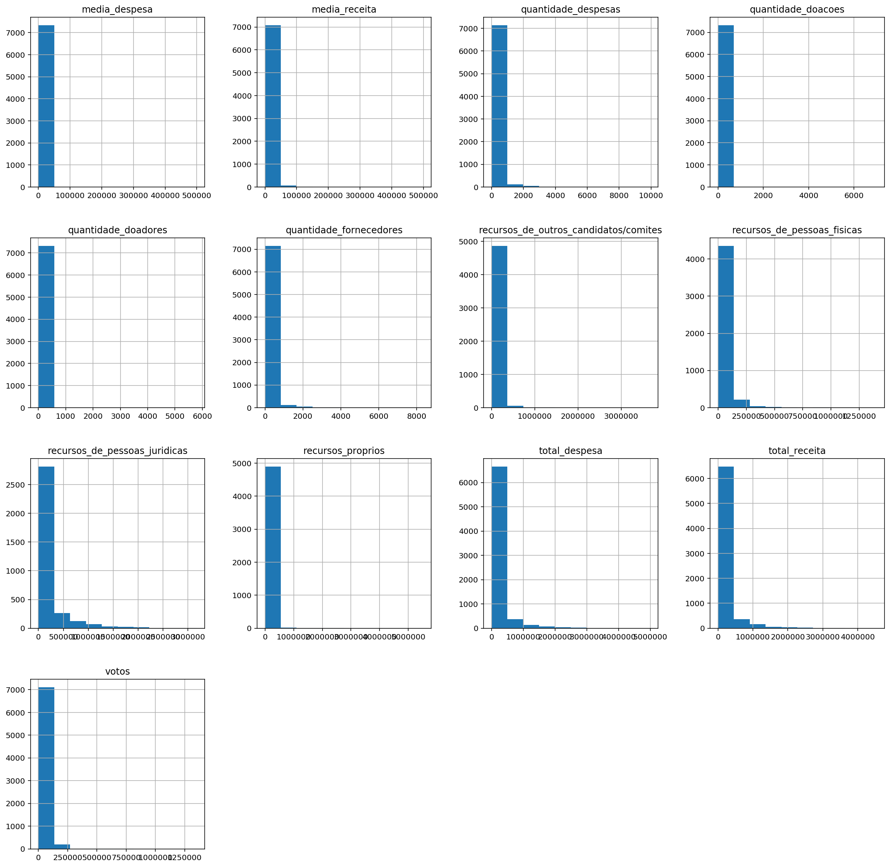


Verificamos através da visualização acima que as variáveis numéricas estão completamente enviesadas à esquerda.

Medidas como correlação ou regressão podem ser bastante influenciadas pelo pico da distribuição, outliers, dentre outros. 

Visando reduzir o efeito do viés nesses atributos aplicaremos uma transformação utilizando uma função logarítmica.


```python
## Correlações entre os atributos numéricos
fig = plt.figure(figsize=(10,8))
sns.heatmap(df.corr(), annot=True, fmt='.2g', linewidths=.5)
plt.show()
```


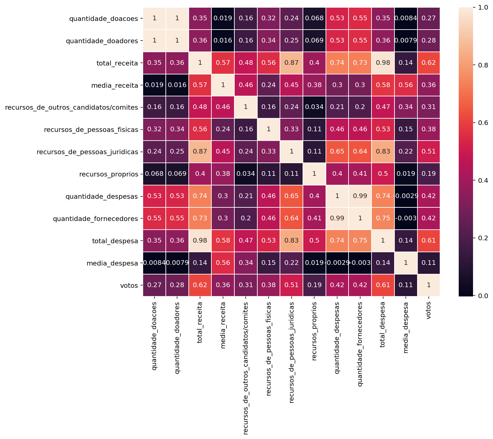


#### Transformações


```python
# Transformando a variável alvo com a função "log"
y = np.log1p(y)

# Transformando os atributos numéricos com a função "log"
## Separando os atributos numéricos
atributos_num = X.dtypes[X.dtypes != "object"].index
## Criando variáveis para os atributos categóricos
atributos_env = X[atributos_num].apply(lambda x: skew(x.dropna())) #compute skewness
atributos_env = atributos_env.index
## Transformando os atributos com a função "log"
X[atributos_env] = np.log1p(X[atributos_env])
```


```python
### Distribuição dos dados após transformações
X[X.dtypes[X.dtypes != "object"].index].hist(bins=10, figsize=(20, 20))
plt.show()
```


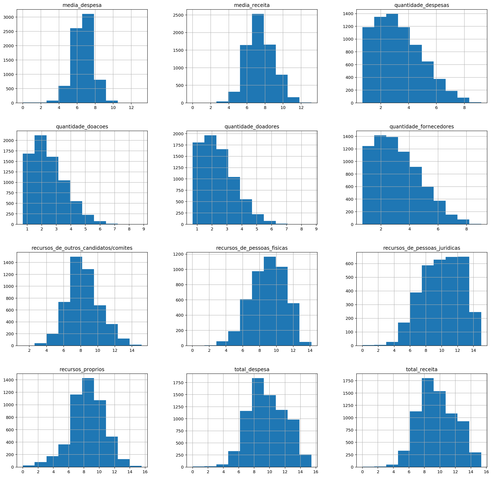


Verificamos que com a aplicação da função logarítmica a maior parte dos atributos estão menos enviesados, no entanto alguns desses atributos ainda apresentam algun enviesamento, como é o caso das quantidades de despesas, doações, doadores e fornecedores.


```python
df_temp = pd.concat((train,test))

# Transformando os atributos numéricos com a função "log"
## Separando os atributos numéricos
atb_num = df_temp.dtypes[df_temp.dtypes != "object"].index
## Criando variáveis para os atributos categóricos
atb_env = df_temp[atb_num].apply(lambda x: skew(x.dropna())) #compute skewness
atb_env = atb_env.index
## Transformando os atributos com a função "log"
df_temp[atb_env] = np.log1p(df_temp[atb_env])

fig = plt.figure(figsize=(10,8))
sns.heatmap(df_temp.corr(), annot=True, fmt='.2g', linewidths=.5)
plt.show()
```


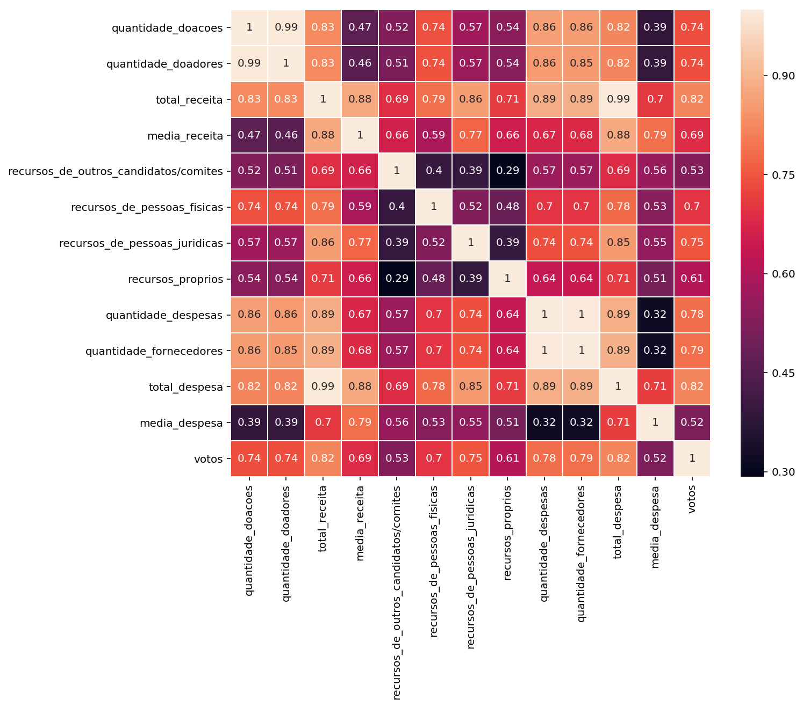


Após as transformações verificamos que a correlação entre os atributos numéricos e a variável alvo (votos) aumentou.


```python
# Converter variáveis categóricas em variáveis indicadoras
X = pd.get_dummies(X)
```


```python
# Preenchendo os valores faltantes com zero
X = X.fillna(0)
```

### Dividindo os dados em treino e teste

Os dados foram divididos considerando-se 60% para treino e 40% para testes


```python
from sklearn.model_selection import train_test_split
```


```python
X_train, X_test, y_train, y_test = train_test_split(X, y, test_size=0.4, random_state=101)
```

## Modelos

### Regressão Linear sem regularização


```python
# Iportando as bibliotecas necessárias
from sklearn.linear_model import LinearRegression
```


```python
# Parametrizando o modelo
lm = LinearRegression()
```


```python
# Ajustando o modelo
lm.fit(X_train,y_train)
```


    LinearRegression(copy_X=True, fit_intercept=True, n_jobs=1, normalize=False)


```python
# Printando a intercepção
print(lm.intercept_)
```

    367327713966.3767


```python
# Printando os coeficientes
coeff_df = pd.DataFrame(lm.coef_,X.columns,columns=['Coefficient'])
coeff_df.head(10)
```


<div>
<style scoped>
    .dataframe tbody tr th:only-of-type {
        vertical-align: middle;
    }

    .dataframe tbody tr th {
        vertical-align: top;
    }

    .dataframe thead th {
        text-align: right;
    }
</style>
<table border="1" class="dataframe">
  <thead>
    <tr style="text-align: right;">
      <th></th>
      <th>Coefficient</th>
    </tr>
  </thead>
  <tbody>
    <tr>
      <th>quantidade_doacoes</th>
      <td>0.051416</td>
    </tr>
    <tr>
      <th>quantidade_doadores</th>
      <td>0.593542</td>
    </tr>
    <tr>
      <th>total_receita</th>
      <td>-0.336630</td>
    </tr>
    <tr>
      <th>media_receita</th>
      <td>0.502820</td>
    </tr>
    <tr>
      <th>recursos_de_outros_candidatos/comites</th>
      <td>-0.007978</td>
    </tr>
    <tr>
      <th>recursos_de_pessoas_fisicas</th>
      <td>0.044898</td>
    </tr>
    <tr>
      <th>recursos_de_pessoas_juridicas</th>
      <td>0.058351</td>
    </tr>
    <tr>
      <th>recursos_proprios</th>
      <td>0.019292</td>
    </tr>
    <tr>
      <th>quantidade_despesas</th>
      <td>0.108593</td>
    </tr>
    <tr>
      <th>quantidade_fornecedores</th>
      <td>1.172241</td>
    </tr>
  </tbody>
</table>
</div>


#### Predições do modelo

Verificando as previsões no conjunto de testes


```python
# Predição de instancias 
lm_predict = lm.predict(X_test)
```


```python
fig, ax = plt.subplots(figsize=(6, 6))

ax.scatter(y_test, lm_predict)
ax.plot([0, 15], [0, 15], '--k', c='gray')
ax.set_ylabel('Qtde votos preditos (log)')
ax.set_xlabel('Qtde de votos Real (log)')
ax.set_title('Regressão Linear sem regularização')
ax.text(1, 13, r'$R^2$=%.4f, RMSE=%.4f' % (
    metrics.r2_score(y_test, lm_predict), np.sqrt(metrics.mean_squared_error(y_test, lm_predict))))
ax.set_xlim([0, 15])
ax.set_ylim([0, 15])

plt.show()
```


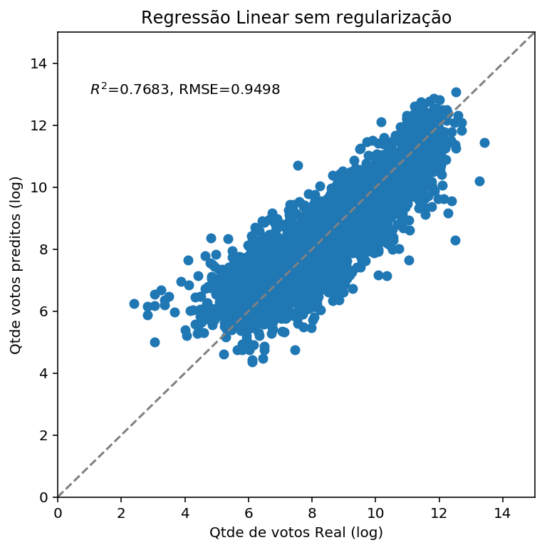


```python
### Histograma residual
fig, ax = plt.subplots(figsize=(6, 6))
sns.distplot((y_test - lm_predict),bins=50)
ax.set_title('Histograma residual - Sem Regularização')
ax.set_xlabel('Log(Votos + 1)')
plt.show()
```


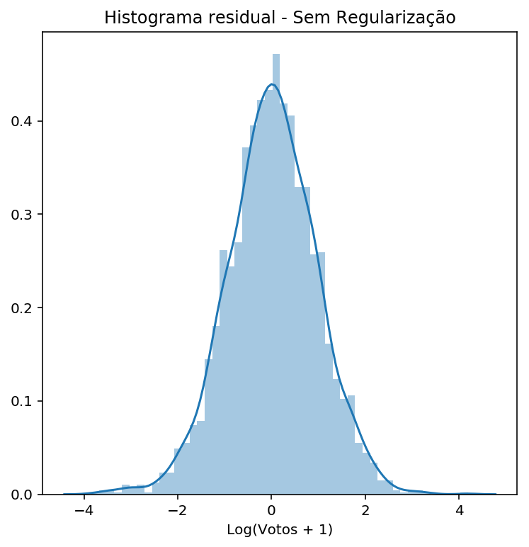


#### Metricas de avaliação do modelo

**Root Mean Square Error** (raiz do erro quadrático médio) (RMSE) é a raiz quadrada da média dos erros quadrados:

$$\sqrt{\frac 1n\sum_{i=1}^n(y_i-\hat{y}_i)^2}$$


```python
# Computando o RMSE (Root Mean Square Error)
print('RMSE:', np.sqrt(metrics.mean_squared_error(y_test, lm_predict)))
```

    RMSE: 0.9497802587582183


```python
#Computando o RMSE (Root Mean Square Error) - Revertendo o log com a função exponencial
print('RMSE:', np.sqrt(metrics.mean_squared_error(np.expm1(y_test), np.expm1(lm_predict))))
```

    RMSE: 32955.47671713665


**Coeficiente de Determinação ($R^2$)**

Uma das formas de avaliar a qualidade do ajuste do modelo é através do coeficiente de determinação. Basicamente, este coeficiente indica quanto o modelo foi capaz de explicar os dados coletados. O coeficiente de determinação é dado pela expressão

$$R^2=\frac{SSR}{SSTO}=1-\frac{SSE}{SSTO}$$, onde:

$$SSR=\sum_{i=1}^{n}(\hat{y}_i-\bar{y})^2$$

$$SSE=\sum_{i=1}^{n}(y_i-\hat{y}_i)^2$$

$$SSTO=\sum_{i=1}^{n}(y_i-\bar{y})^2$$


```python
# Coeficiente de determinação (R²)
print('R²:', metrics.r2_score(y_test, lm_predict, sample_weight=None,multioutput="uniform_average"))
```

    R²: 0.7683174748636059


Verificando o R2 acima o modelo consegue explicar 76,83% dos valores observados

### Regressão linear com regularização Ridge


```python
# Iportando as bibliotecas necessárias
from sklearn.linear_model import Ridge, RidgeCV, ElasticNet, LassoCV, LassoLarsCV
from sklearn.model_selection import cross_val_score

def rmse_cv(model):
    rmse= np.sqrt(-cross_val_score(model, X_train, y_train, scoring="neg_mean_squared_error", cv = 5))
    return(rmse)
```


```python
# Parametrizando o modelo
model_ridge = Ridge(alpha=5)
```


```python
# Ajustando o modelo
model_ridge.fit(X_train,y_train)
```


    Ridge(alpha=5, copy_X=True, fit_intercept=True, max_iter=None,
       normalize=False, random_state=None, solver='auto', tol=0.001)


```python
# Printando a intercepção
print(model_ridge.intercept_)
```

    2.6134047401261036


```python
# Coeficente da regressão com regularização ridge
coef_ridge = pd.DataFrame(model_ridge.coef_,X_train.columns,columns=['Coefficient'])
coef_ridge.head(10)
```


<div>
<style scoped>
    .dataframe tbody tr th:only-of-type {
        vertical-align: middle;
    }

    .dataframe tbody tr th {
        vertical-align: top;
    }

    .dataframe thead th {
        text-align: right;
    }
</style>
<table border="1" class="dataframe">
  <thead>
    <tr style="text-align: right;">
      <th></th>
      <th>Coefficient</th>
    </tr>
  </thead>
  <tbody>
    <tr>
      <th>quantidade_doacoes</th>
      <td>0.068976</td>
    </tr>
    <tr>
      <th>quantidade_doadores</th>
      <td>0.589239</td>
    </tr>
    <tr>
      <th>total_receita</th>
      <td>-0.350011</td>
    </tr>
    <tr>
      <th>media_receita</th>
      <td>0.521091</td>
    </tr>
    <tr>
      <th>recursos_de_outros_candidatos/comites</th>
      <td>-0.007651</td>
    </tr>
    <tr>
      <th>recursos_de_pessoas_fisicas</th>
      <td>0.044876</td>
    </tr>
    <tr>
      <th>recursos_de_pessoas_juridicas</th>
      <td>0.060478</td>
    </tr>
    <tr>
      <th>recursos_proprios</th>
      <td>0.018684</td>
    </tr>
    <tr>
      <th>quantidade_despesas</th>
      <td>0.134593</td>
    </tr>
    <tr>
      <th>quantidade_fornecedores</th>
      <td>0.887887</td>
    </tr>
  </tbody>
</table>
</div>


#### Predições do modelo


```python
# Predição do modelo
ridge_predict = model_ridge.predict(X_test)
```


```python
fig, ax = plt.subplots(figsize=(6, 6))

ax.scatter(y_test, ridge_predict)
ax.plot([0, 15], [0, 15], '--k', c='gray')
ax.set_ylabel('Qtde votos preditos (log)')
ax.set_xlabel('Qtde de votos Real (log)')
ax.set_title('Regressão Linear com regularização RIDGE')
ax.text(1, 13, r'$R^2$=%.4f, RMSE=%.4f' % (
    metrics.r2_score(y_test, ridge_predict), np.sqrt(metrics.mean_squared_error(y_test, ridge_predict))))
ax.set_xlim([0, 15])
ax.set_ylim([0, 15])

plt.show()
```


```python
### Histograma residual
fig, ax = plt.subplots(figsize=(6, 6))
sns.distplot((y_test - ridge_predict),bins=50)
ax.set_title('Histograma residual - RIDGE')
ax.set_xlabel('Log(Votos + 1)')
plt.show()
```


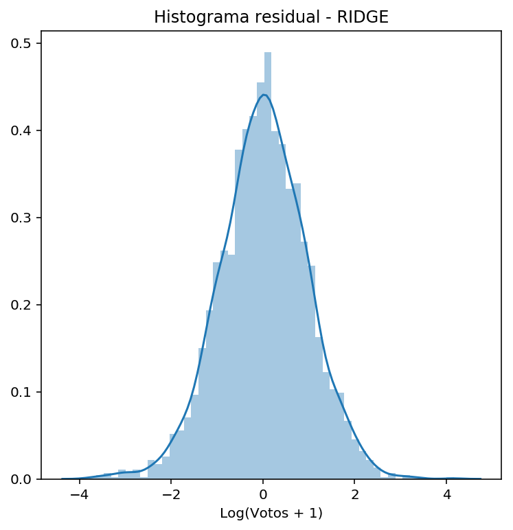


##### Metricas de avaliação do modelo


```python
# Root Mean Square Error
print('RMSE:', np.sqrt(metrics.mean_squared_error(y_test, ridge_predict)))
```

    RMSE: 0.9489998785285962


```python
# Coeficiente de determinação (R²)
print('R²:', metrics.r2_score(y_test, ridge_predict, sample_weight=None,multioutput="uniform_average"))
```

    R²: 0.7686980390705128


O principal parâmetro de ajuste para o modelo Ridge é alpha - um parâmetro de regularização que mede quão flexível é nosso modelo. Quanto maior a regularização, menos propenso será o nosso modelo de overfit. No entanto, também perderá a flexibilidade e poderá não capturar todo o sinal nos dados.


```python
alphas = [0.01, 0.05, 0.1, 0.3, 1, 3, 5, 10, 15, 20]
cv_ridge = [rmse_cv(Ridge(alpha = alpha)).mean() 
            for alpha in alphas]
```


```python
fig, ax = plt.subplots(figsize=(6, 6))
cv_ridge = pd.Series(cv_ridge, index = alphas)
cv_ridge.plot(title = "Validação")
plt.xlabel("alpha")
plt.ylabel("rmse")
plt.show()
```


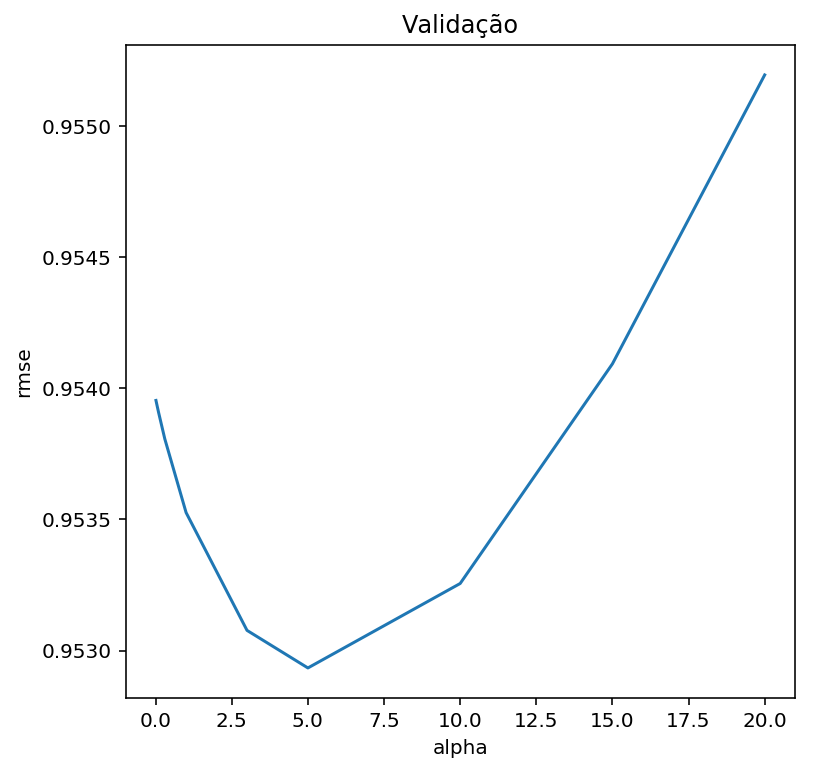


Observe a curva em forma de U acima. Quando alfa é muito grande, a regularização é muito forte e o modelo não consegue capturar todas as complexidades dos dados. Se, no entanto, deixarmos o modelo ser muito flexível (alfa pequeno), o modelo começa a se sobrepor. Um valor de alfa = 10 é quase certo com base no gráfico acima.


```python
cv_ridge.min()
```


    0.9529334692601521


Para a regressão de Ridge, obtivemos um RMSE de cerca de 0,947

### Regressão linear com regularização Lasso


```python
model_lasso = LassoCV(alphas = [1, 0.1, 0.001, 0.0005], max_iter=10000).fit(X_train, y_train)
```


```python
rmse_cv(model_lasso).mean()
```


    0.9533504297515574


```python
# Printando a intercepção
print(model_lasso.intercept_)
```

    2.7111779563269813


```python
# Coeficientes da regressão com regularização lasso
coef_lasso = pd.DataFrame(model_lasso.coef_, index = X_train.columns, columns=['Coefficient'])
coef_lasso.head(10)
```


<div>
<style scoped>
    .dataframe tbody tr th:only-of-type {
        vertical-align: middle;
    }

    .dataframe tbody tr th {
        vertical-align: top;
    }

    .dataframe thead th {
        text-align: right;
    }
</style>
<table border="1" class="dataframe">
  <thead>
    <tr style="text-align: right;">
      <th></th>
      <th>Coefficient</th>
    </tr>
  </thead>
  <tbody>
    <tr>
      <th>quantidade_doacoes</th>
      <td>0.040191</td>
    </tr>
    <tr>
      <th>quantidade_doadores</th>
      <td>0.587111</td>
    </tr>
    <tr>
      <th>total_receita</th>
      <td>-0.328817</td>
    </tr>
    <tr>
      <th>media_receita</th>
      <td>0.489300</td>
    </tr>
    <tr>
      <th>recursos_de_outros_candidatos/comites</th>
      <td>-0.007769</td>
    </tr>
    <tr>
      <th>recursos_de_pessoas_fisicas</th>
      <td>0.044839</td>
    </tr>
    <tr>
      <th>recursos_de_pessoas_juridicas</th>
      <td>0.059667</td>
    </tr>
    <tr>
      <th>recursos_proprios</th>
      <td>0.018832</td>
    </tr>
    <tr>
      <th>quantidade_despesas</th>
      <td>0.108211</td>
    </tr>
    <tr>
      <th>quantidade_fornecedores</th>
      <td>1.042395</td>
    </tr>
  </tbody>
</table>
</div>


```python
# R-quadraro para o modelo com regularização ridge
model_lasso.score(X_train,y_train)
```


    0.7785785143321863


```python
# Predição do modelo
lasso_predict = model_lasso.predict(X_test)
```


```python
# Root Mean Square Error
print('RMSE:', np.sqrt(metrics.mean_squared_error(y_test, lasso_predict)))
```

    RMSE: 0.9486114571684503


```python
# Coeficiente de determinação (R²)
print('R²:',metrics.r2_score(y_test, lasso_predict, sample_weight=None,multioutput="uniform_average"))
```

    R²: 0.7688873420160903


```python
# Coeficientes da regressão com regularização lasso
coef_lasso = pd.Series(model_lasso.coef_, index = X_train.columns)
```

Uma coisa interessante sobre o Lasso é que ele apresenta seleção para você - definindo coeficientes de recursos que ele considera sem importância para zero. Vamos dar uma olhada nos coeficientes:


```python
print("O Lasso selecionou " + str(sum(coef_lasso != 0)) + " variaveis e eliminou outras " +  str(sum(coef_lasso == 0)) + " variables")
```

    O Lasso selecionou 74 variaveis e eliminou outras 11 variables


Podemos também dar uma olhada diretamente nos coeficientes mais importantes:


```python
# Selecionando os 10 primeiros e os 10 últimos coeficientes
imp_coef_lasso = pd.concat([coef_lasso.sort_values().head(10),
                     coef_lasso.sort_values().tail(10)])
```


```python
matplotlib.rcParams['figure.figsize'] = (8.0, 10.0)
imp_coef_lasso.plot(kind = "barh")
plt.title("Coeficientes no Modelo com Lasso")
plt.show()
```


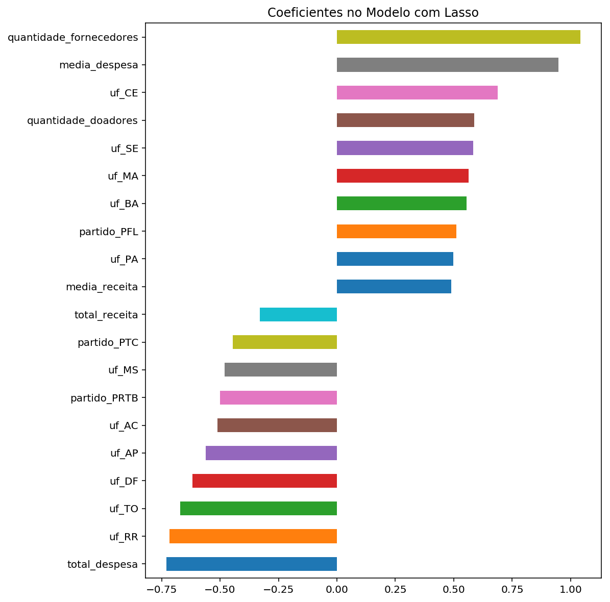


Podemos perceber pela visualização acima que o atributo mais importante é `quantidade_fornecedores` seguido da `media_despesa`.


```python
fig, ax = plt.subplots(figsize=(6, 6))

ax.scatter(y_test, lasso_predict)
ax.plot([0, 15], [0, 15], '--k', c='gray')
ax.set_ylabel('Qtde votos preditos (log)')
ax.set_xlabel('Qtde de votos Real (log)')
ax.set_title('Regressão Linear com regularização LASSO')
ax.text(1, 13, r'$R^2$=%.4f, RMSE=%.4f' % (
    metrics.r2_score(y_test, lasso_predict), np.sqrt(metrics.mean_squared_error(y_test, lasso_predict))))
ax.set_xlim([0, 15])
ax.set_ylim([0, 15])

plt.show()
```


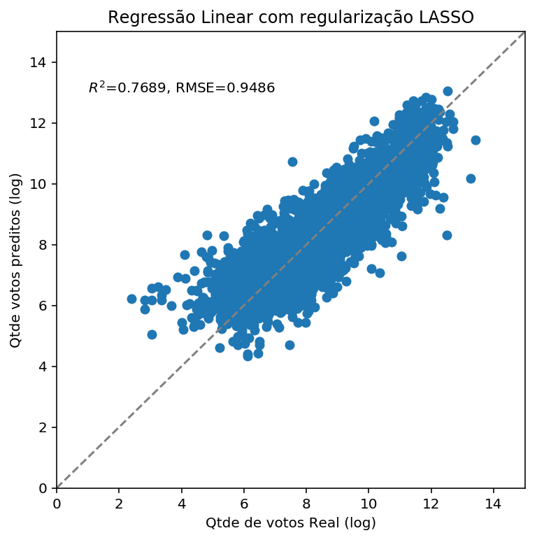


```python
### Histograma residual
fig, ax = plt.subplots(figsize=(6, 6))
sns.distplot((y_test - lasso_predict),bins=50)
ax.set_title('Histograma residual - LASSO')
ax.set_xlabel('Log(Votos + 1)')
plt.show()
```


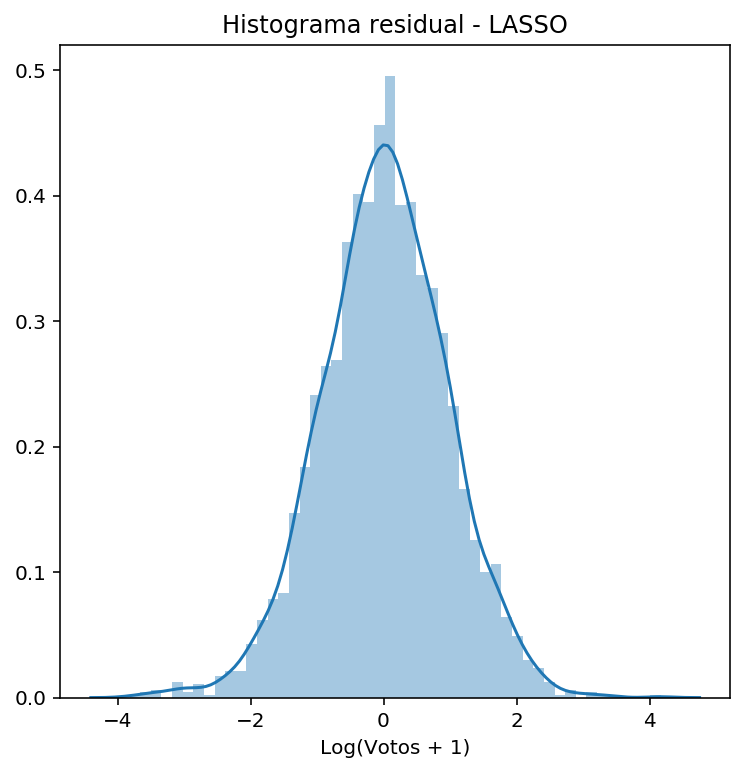


```python
from matplotlib.lines import Line2D
fig, ax = plt.subplots(figsize=(12, 12))

ax.scatter(np.expm1(y_test), np.expm1(lm_predict), c='b', alpha=0.6)
ax.scatter(np.expm1(y_test), np.expm1(ridge_predict), c='r', alpha=0.5)
ax.scatter(np.expm1(y_test), np.expm1(lasso_predict), c='g', alpha=0.4)
ax.plot([0, 400000], [0, 400000], '--k')
ax.set_ylabel('Qtde votos preditos')
ax.set_xlabel('Qtde de votos Real')
ax.set_title('Comparação da predição dos modelos de Regressão Linear')
ax.text(200000, 390000, r'$R^2$=%.6f, RMSE=%.2f' % (
    metrics.r2_score(y_test, lm_predict), np.sqrt(metrics.mean_squared_error(np.expm1(y_test), \
    np.expm1(lm_predict)))), bbox={'facecolor': 'b', 'alpha': 0.5, 'pad': 3}, color='w')
ax.text(200000, 380000, r'$R^2$=%.6f, RMSE=%.2f' % (
    metrics.r2_score(y_test, ridge_predict), np.sqrt(metrics.mean_squared_error(np.expm1(y_test), \
    np.expm1(ridge_predict)))), bbox={'facecolor': 'r', 'alpha': 0.5, 'pad': 3}, color='w')
ax.text(200000, 370000, r'$R^2$=%.6f, RMSE=%.2f' % (
    metrics.r2_score(y_test, lasso_predict), np.sqrt(metrics.mean_squared_error(np.expm1(y_test), \
    np.expm1(lasso_predict)))), bbox={'facecolor': 'g', 'alpha': 0.5, 'pad': 3}, color='w')
ax.set_xlim([0, 400000])
ax.set_ylim([0, 400000])
# Legendas
custom_lines = [Line2D([0], [0], color='b', lw=4),
                Line2D([0], [0], color='r', lw=4),
                Line2D([0], [0], color='g', lw=4)]
ax.legend(custom_lines, ["Sem Regularização","Regularização RIDGE", "Regularização LASSO"], \
           title="Modelos", frameon=False, loc='upper left')
plt.show()
```


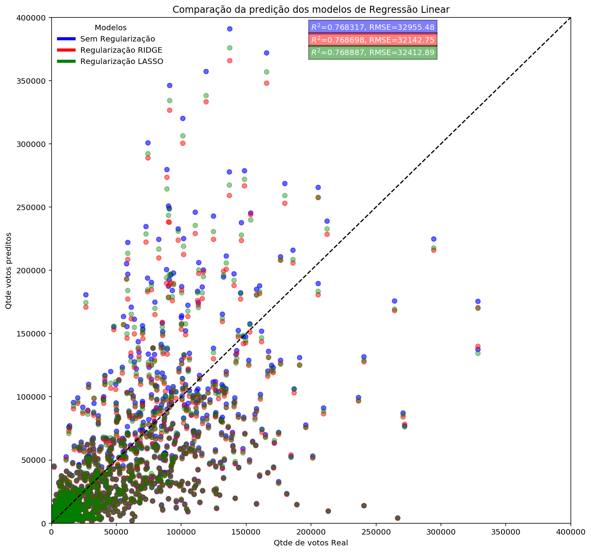


Pela visualização acima verificamos que as regresões lineares tiveram um desempenho parecido com $R^2$ um pouco maior para a Regressão linear com regularização LASSO e RMSE menor para a Regressão Linear com regularização RIDGE.

###  KNN Regressor


```python
from sklearn.neighbors import KNeighborsRegressor
```


```python
knn = KNeighborsRegressor(n_neighbors=8,weights='uniform',p=2)
```


```python
knn.fit(X_train,y_train)
```


    KNeighborsRegressor(algorithm='auto', leaf_size=30, metric='minkowski',
              metric_params=None, n_jobs=1, n_neighbors=8, p=2,
              weights='uniform')


```python
knn_predict = knn.predict(X_test)
```


```python
# Root Mean Square Error
print('RMSE:', np.sqrt(metrics.mean_squared_error(y_test, knn_predict)))
```

    RMSE: 1.0012312716097589


```python
# Coeficiente de determinação (R²)
print('R²:', metrics.r2_score(y_test, knn_predict, sample_weight=None,multioutput="uniform_average"))
```

    R²: 0.7425364150998915


```python
fig, ax = plt.subplots(figsize=(6, 6))

ax.scatter(y_test, lasso_predict)
ax.plot([0, 15], [0, 15], '--k', c='gray')
ax.set_ylabel('Qtde votos preditos (log)')
ax.set_xlabel('Qtde de votos Real (log)')
ax.set_title('Regressão Linear com regularização LASSO')
ax.text(1, 13, r'$R^2$=%.4f, RMSE=%.4f' % (
    metrics.r2_score(y_test, knn_predict), np.sqrt(metrics.mean_squared_error(y_test, knn_predict))))
ax.set_xlim([0, 15])
ax.set_ylim([0, 15])

plt.show()
```


```python
### Histograma residual
fig, ax = plt.subplots(figsize=(6, 6))
sns.distplot((y_test - knn_predict),bins=50)
ax.set_title('Histograma residual - KNN')
ax.set_xlabel('Log(Votos + 1)')
plt.show()
```


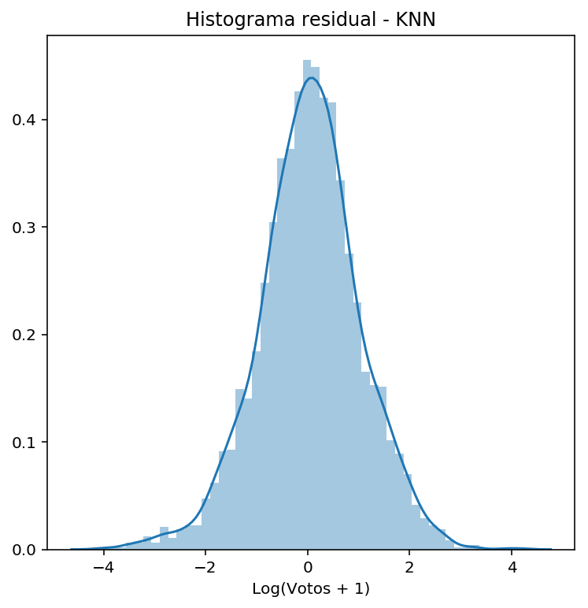


O KNN Regressor teve um desempenho menor que as Regressões Lineares, com $R^2$ = 0.742536 e RMSE = 1.0012312716097589

### Random Forest Regressor


```python
# Import the model we are using
from sklearn.ensemble import RandomForestRegressor
```


```python
# Instantiate model with 100 decision trees
rfr = RandomForestRegressor(n_estimators = 100, random_state = 42)
```


```python
# Train the model on training data
rfr.fit(X_train,y_train)
```


    RandomForestRegressor(bootstrap=True, criterion='mse', max_depth=None,
               max_features='auto', max_leaf_nodes=None,
               min_impurity_decrease=0.0, min_impurity_split=None,
               min_samples_leaf=1, min_samples_split=2,
               min_weight_fraction_leaf=0.0, n_estimators=100, n_jobs=1,
               oob_score=False, random_state=42, verbose=0, warm_start=False)


```python
# Use the forest's predict method on the test data
rfr_predict = rfr.predict(X_test)
```


```python
# Calculate the absolute errors
errors = abs(y_test - rfr_predict)
```


```python
# Print out the mean absolute error (mae)
print('Mean Absolute Error:', np.mean(errors))
```

    Mean Absolute Error: 0.7299339175342557


```python
# Root Mean Square Error
print('RMSE:', np.sqrt(metrics.mean_squared_error(y_test, rfr_predict)))
```

    RMSE: 0.9414205719737669


```python
# Coeficiente de determinação (R²)
print('R²:', metrics.r2_score(y_test, rfr_predict, sample_weight=None,multioutput="uniform_average"))
```

    R²: 0.772377929443089


```python
# Calculate mean absolute percentage error (MAPE)
mape = 100 * (errors / y_test)
```


```python
# Calculate and display accuracy
accuracy = 100 - np.mean(mape)
print('Accuracy:', round(accuracy, 2), '%.')
```

    Accuracy: 90.31 %.


```python
# Try different numbers of n_estimators - this will take a minute or so
estimators = np.arange(10, 200, 10)
scores = []
for n in estimators:
    rfr.set_params(n_estimators=n)
    rfr.fit(X_train, y_train)
    scores.append(rfr.score(X_test, y_test))
plt.title("Effect of n_estimators")
plt.xlabel("n_estimator")
plt.ylabel("score")
plt.plot(estimators, scores)
```


    [<matplotlib.lines.Line2D at 0x7f0b762c8fd0>]


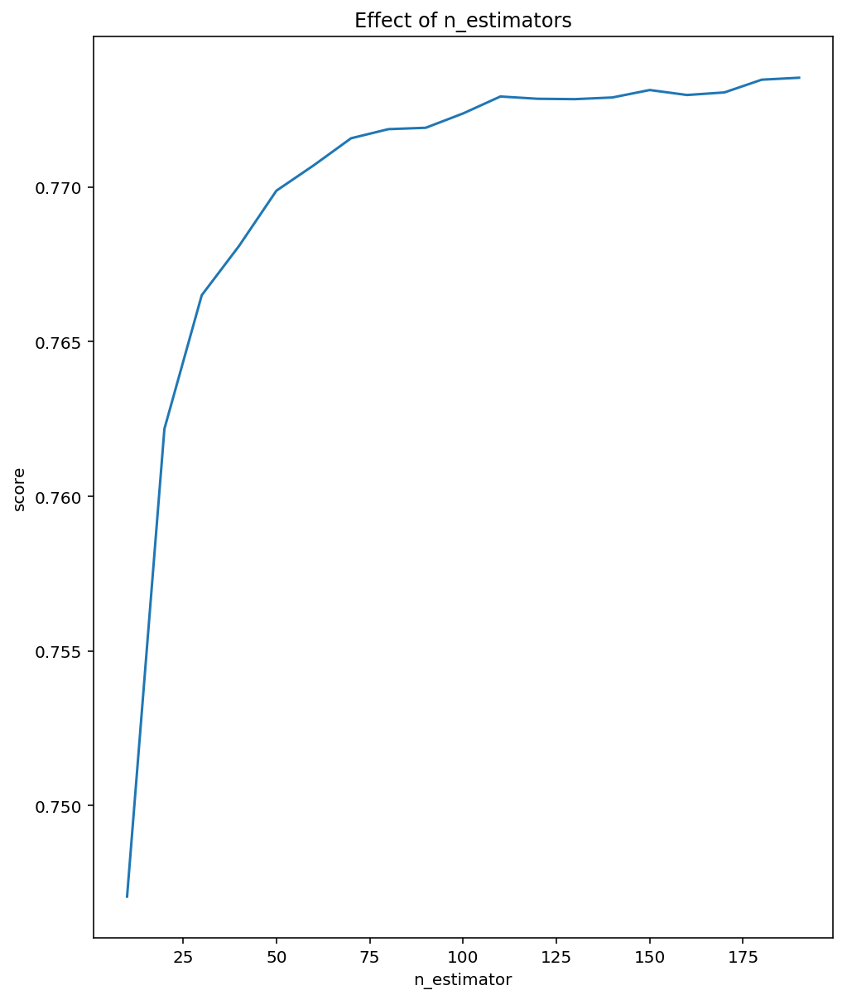


```python
fig, ax = plt.subplots(figsize=(6, 6))

ax.scatter(y_test, rfr_predict)
ax.plot([0, 15], [0, 15], '--k', c='gray')
ax.set_ylabel('Qtde votos preditos (log)')
ax.set_xlabel('Qtde de votos Real (log)')
ax.set_title('Random Forest Regressor')
ax.text(1, 13, r'$R^2$=%.4f, RMSE=%.4f' % (
    metrics.r2_score(y_test, rfr_predict), np.sqrt(metrics.mean_squared_error(y_test, rfr_predict))))
ax.set_xlim([0, 15])
ax.set_ylim([0, 15])

plt.show()
```


```python
### Histograma residual
fig, ax = plt.subplots(figsize=(6, 6))
sns.distplot((y_test - rfr_predict),bins=50)
ax.set_title('Histograma residual - Randon Forest Regressor')
ax.set_xlabel('Log(Votos + 1)')
plt.show()
```


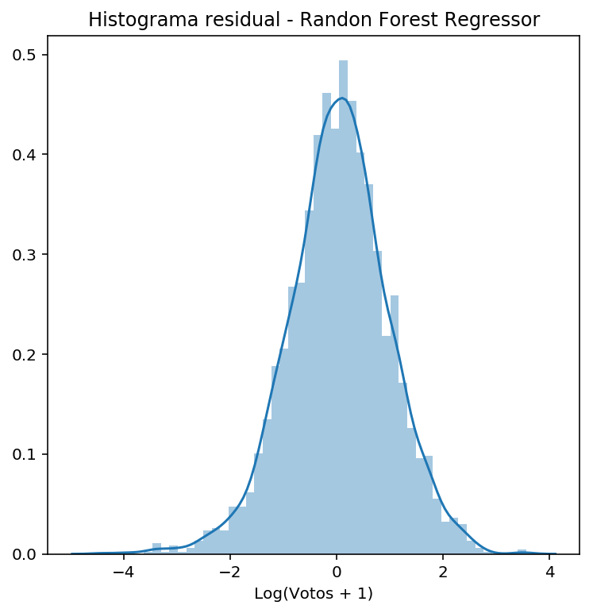


### Modelo SVR


```python
from sklearn.svm import SVR
```


```python
svr_model = SVR(kernel='rbf', C=1e3, gamma=0.1, epsilon=1.0)
#svr_model = SVR(kernel='linear', C=1e3, gamma=0.1, epsilon=1.0)
```


```python
svr_model.fit(X_train,y_train)
```


    SVR(C=1000.0, cache_size=200, coef0=0.0, degree=3, epsilon=1.0, gamma=0.1,
      kernel='rbf', max_iter=-1, shrinking=True, tol=0.001, verbose=False)


```python
svr_predict = svr_model.predict(X_test)
```


```python
fig, ax = plt.subplots(figsize=(6, 6))

ax.scatter(y_test, svr_predict)
ax.plot([0, 15], [0, 15], '--k', c='gray')
ax.set_ylabel('Qtde votos preditos (log)')
ax.set_xlabel('Qtde de votos Real (log)')
ax.set_title('SVR')
ax.text(1, 13, r'$R^2$=%.4f, RMSE=%.4f' % (
    metrics.r2_score(y_test, svr_predict), np.sqrt(metrics.mean_squared_error(y_test, svr_predict))))
ax.set_xlim([0, 15])
ax.set_ylim([0, 15])

plt.show()
```


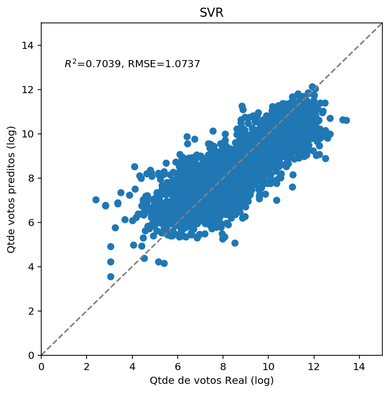


```python
### Histograma residual
fig, ax = plt.subplots(figsize=(6, 6))
sns.distplot((y_test - svr_predict),bins=50)
ax.set_title('Histograma residual - SVR')
ax.set_xlabel('Log(Votos + 1)')
plt.show()
```


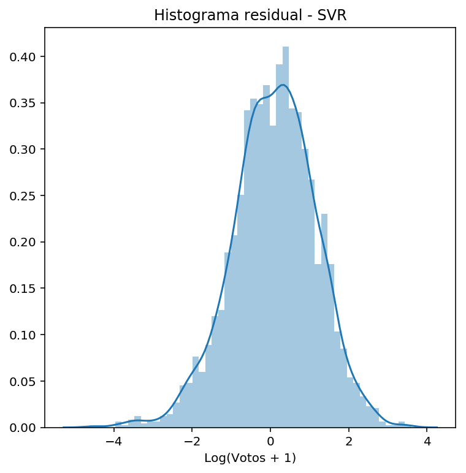


```python
# Root Mean Square Error
print('RMSE:', np.sqrt(metrics.mean_squared_error(y_test, svr_predict)))
```

    RMSE: 1.0737196697226516


```python
# Coeficiente de determinação (R²)
print('R²:', metrics.r2_score(y_test, svr_predict, sample_weight=None,multioutput="uniform_average"))
```

    R²: 0.7039065370992588


### Regression trees


```python
# Iportando o modelo de árvore de regressão
from sklearn.tree import DecisionTreeRegressor
```


```python
# Parametrizando o modelo
rt_model = DecisionTreeRegressor(criterion="mse",min_samples_leaf=100)
```


```python
# Ajustando o modelo
rt_model.fit(X_train,y_train)
```


    DecisionTreeRegressor(criterion='mse', max_depth=None, max_features=None,
               max_leaf_nodes=None, min_impurity_decrease=0.0,
               min_impurity_split=None, min_samples_leaf=100,
               min_samples_split=2, min_weight_fraction_leaf=0.0,
               presort=False, random_state=None, splitter='best')


```python
# Predição de instancias 
rt_predict = rt_model.predict(X_test)
```


```python
# Root Mean Square Error
print('RMSE:', np.sqrt(metrics.mean_squared_error(y_test, rt_predict)))
```

    RMSE: 1.005743869697156


```python
# Coeficiente de determinação (R²)
print('R²:', metrics.r2_score(y_test, rt_predict, sample_weight=None,multioutput="uniform_average"))
```

    R²: 0.7402103832922939


```python
"""
Plotar o RMSE em relação ao número mínimo de instâncias
""" 
fig = plt.figure(figsize=(12,6))
ax0 = fig.add_subplot(111) 
RMSE_train = []
RMSE_test = []
for i in range(1,100):
    #Paramterize the model and let i be the number of minimum instances per leaf node
    rt_model = DecisionTreeRegressor(criterion="mse",min_samples_leaf=i)   
    #Train the model
    rt_model.fit(X_train,y_train)
    #Predict query instances
    predicted_train = rt_model.predict(X_train)
    predicted_test = rt_model.predict(X_test)
    #Calculate and append the RMSEs
    RMSE_train.append(np.sqrt(np.sum(np.sqrt(metrics.mean_squared_error(y_train, predicted_train)))))
    RMSE_test.append(np.sqrt(np.sum(np.sqrt(metrics.mean_squared_error(y_test, predicted_test)))))
   
ax0.plot(range(1,100),RMSE_test,label='Test_Data', color='r')
ax0.plot(range(1,100),RMSE_train,label='Train_Data', color='b')
ax0.legend()
ax0.set_title('RMSE em relação ao número mínimo de instâncias por nó')
ax0.set_xlabel('#Instancias')
ax0.set_ylabel('RMSE')
plt.show()
```


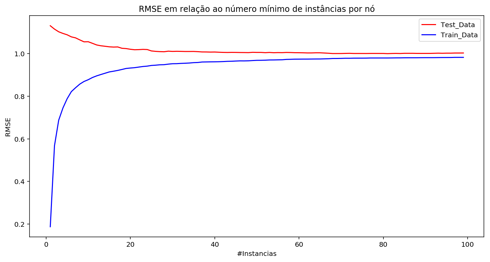


```python
fig, ax = plt.subplots(figsize=(6, 6))

ax.scatter(y_test, rt_predict)
ax.plot([0, 15], [0, 15], '--k', c='gray')
ax.set_ylabel('Qtde votos preditos (log)')
ax.set_xlabel('Qtde de votos Real (log)')
ax.set_title('Árvore de Regressão')
ax.text(1, 13, r'$R^2$=%.4f, RMSE=%.4f' % (
    metrics.r2_score(y_test, rt_predict), np.sqrt(metrics.mean_squared_error(y_test, rt_predict))))
ax.set_xlim([0, 15])
ax.set_ylim([0, 15])

plt.show()
```


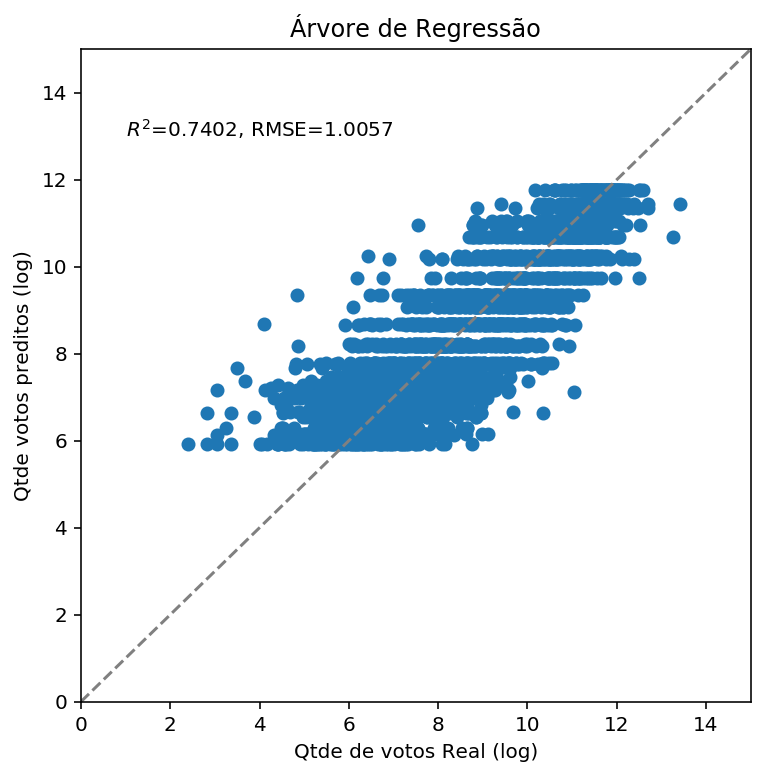


```python
### Histograma residual
fig, ax = plt.subplots(figsize=(6, 6))
sns.distplot((y_test - svr_predict),bins=50)
ax.set_title('Histograma residual - Árvore de Regressão')
ax.set_xlabel('Log(Votos + 1)')
plt.show()
```


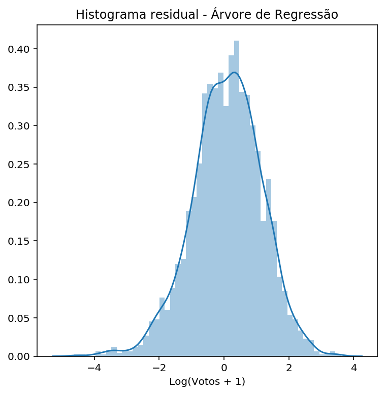


### Conclusão

Dos modelos obtivemos os seguintes resultados:

**Regressão Linear sem regularização**
- RMSE: 0.9497802587582183
- $R^2$: 0.7683174748636059

**Regressão Linear com regularização RIDGE**
- RMSE: 0.9489998785285962
- $R^2$: 0.7686980390705128

**Regressão Linear com regularização LASSO**
- RMSE: 0.9533504297515574
- $R^2$: 0.7785785143321863

**KNN Regressor**
- RMSE: 1.0012312716097589
- $R^2$: 0.7425364150998915

**Random Forest Regressor**
- RMSE: 0.9414205719737669
- $R^2$: 0.772377929443089

**SVR**
- RMSE: 1.0737196697226516
- $R^2$: 0.7039065370992588

**Regression trees**
- RMSE: 1.005743869697156
- $R^2$: 0.740210383292294

Todos os modelos avaliados conseguiram estimar mais de 70% da variável indepentente (votos), no entanto, os modelos de regressão linear obtiveram um melhor desempenho na estimativa de votos, sendo o modelo com regressão linear com regularização LASSO o com maior *Coeficiete de determinação*, explicando 77,85% da variância dos votos estimadas pelos atributos selecionados para o modelo.

