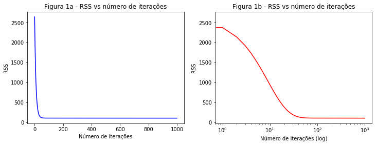

# Implementando Regressão Linear do Zero

### Descrição

Nessa tarefa você vai programar regressão linear simples do zero em python. 

e seguir o passo a passo da implementação. Embora o código esteja disponível no github do autor (Links para um site externo)Links para um site externo do vídeo, é importante que você digite o código enquanto assiste. Vários estudos já mostraram que aprendemos melhor dessa forma do que somente assistindo. Teste o programa nos dados também fornecidos no github do autor.

Feito isso,  a sua tarefa agora é a seguinte:

1. Rode o mesmo programa nos dados contendo anos de escolaridade (primeira coluna) versus salário (segunda coluna). Baixe os dados aquiVisualizar o documento. Esse exemplo foi trabalhado em sala de aula. 

2. Modifique o código original para imprimir o RSS a cada iteração do gradiente descendente.

3. O que acontece com o RSS ao longo das iterações (aumenta ou diminui) se você usar 1000 iterações? Plote o RSS vs número de iterações.

4. Teste valores diferentes do número de iterações e learning_rate até que w0 e w1 sejam aproximadamente iguais a -39 e 5 respectivamente. Reporte os valores do número de iterações e learning_rate usados para atingir esses valores.

5. O algoritmo do vídeo usa o número de iterações como critério de parada. Mude o algoritmo para considerar um critério de parada que é relacionado ao tamanho do gradiente (como no algoritmo apresentado em sala). Plote o tamanho do gradiente vs número de iterações.

6. Ache um valor de tolerância que se aproxime dos valores dos parâmetros do item 4 acima. Que valor foi esse?

7. Implemente a forma fechada (equações normais) de calcular os coeficientes de regressão (vide algoritmo nos slides). Compare o tempo de processamento com o gradiente descendente considerando sua solução do item 6.

## 1. Rode o mesmo programa nos dados contendo anos de escolaridade (primeira coluna) versus salário (segunda coluna)


```python
from numpy import *  
```


```python
# y = mx + b
# m is slope, b is y-intercept
def compute_error_for_line_given_points(b, m, points):
    totalError = 0
    for i in range(0, len(points)):
        x = points[i, 0]
        y = points[i, 1]
        totalError += (y - (m * x + b)) ** 2
    return totalError / float(len(points))

def step_gradient(b_current, m_current, points, learningRate):
    b_gradient = 0
    m_gradient = 0
    N = float(len(points))
    for i in range(0, len(points)):
        x = points[i, 0]
        y = points[i, 1]
        b_gradient += -(2/N) * (y - ((m_current * x) + b_current))
        m_gradient += -(2/N) * x * (y - ((m_current * x) + b_current))
    new_b = b_current - (learningRate * b_gradient)
    new_m = m_current - (learningRate * m_gradient)
    return [new_b, new_m]

def gradient_descent_runner(points, starting_b, starting_m, learning_rate, num_iterations):
    b = starting_b
    m = starting_m
    for i in range(num_iterations):
        b, m = step_gradient(b, m, array(points), learning_rate)
    return [b, m]

def run():
    points = genfromtxt("income.csv", delimiter=",")
    # hyperparamets
    learning_rate = 0.0001
    initial_b = 0 # initial y-intercept guess
    initial_m = 0 # initial slope guess
    num_iterations = 1000
    print("Starting gradient descent at b = {0}, m = {1}, error = {2}".format(initial_b, initial_m, compute_error_for_line_given_points(initial_b, initial_m, points)))
    print("Running...?")
    [b, m] = gradient_descent_runner(points, initial_b, initial_m, learning_rate, num_iterations)
    print("After {0} iterations b = {1}, m = {2}, error = {3}".format(num_iterations, b, m, compute_error_for_line_given_points(b, m, points)))

if __name__ == '__main__':
    run()
```

    Starting gradient descent at b = 0, m = 0, error = 2946.6344970460195
    Running...?
    After 1000 iterations b = -0.18234255376510086, m = 3.262182267596014, error = 103.39842291729676


## 2. Modifique o código original para imprimir o RSS a cada iteração do gradiente descendente.


```python
def gradient_descent_runner(points, starting_b, starting_m, learning_rate, num_iterations):
    b = starting_b
    m = starting_m
    for i in range(num_iterations):
        b, m = step_gradient(b, m, array(points), learning_rate)
        print("Iteração = {0}, RSS = {1}".format(i, compute_error_for_line_given_points(b, m, points)))
    return [b, m]

run()
```

    Starting gradient descent at b = 0, m = 0, error = 2946.6344970460195
    Running...?
    Iteração = 0, RSS = 2648.2381266261386
    Iteração = 1, RSS = 2381.1735926230144
    Iteração = 2, RSS = 2142.151013653971
    Iteração = 3, RSS = 1928.2259499305476
    Iteração = 4, RSS = 1736.7631314659504
    Iteração = 5, RSS = 1565.4039948653665
    Iteração = 6, RSS = 1412.0376287932477
    Iteração = 7, RSS = 1274.7747702022896
    Iteração = 8, RSS = 1151.924530990372
    Iteração = 9, RSS = 1041.9735683871631
    Iteração = 10, RSS = 943.5674424757678
    Iteração = 11, RSS = 855.4939311975465
    Iteração = 12, RSS = 776.6680973019634
    Iteração = 13, RSS = 706.1189232850785
    Iteração = 14, RSS = 642.9773496759485
    Iteração = 15, RSS = 586.4655693176774
    Iteração = 16, RSS = 535.8874457621318
    Iteração = 17, RSS = 490.61993774500473
    Iteração = 18, RSS = 450.105424101551
    Iteração = 19, RSS = 413.8448345756185
    Iteração = 20, RSS = 381.3915019021827
    Iteração = 21, RSS = 352.34565942878487
    Iteração = 22, RSS = 326.34951649348716
    Iteração = 23, RSS = 303.0828508942081
    Iteração = 24, RSS = 282.2590641541991
    Iteração = 25, RSS = 263.6216509895024
    Iteração = 26, RSS = 246.94103948667004
    Iteração = 27, RSS = 232.01176306571264
    Iteração = 28, RSS = 218.6499293904183
    Iteração = 29, RSS = 206.69095504620364
    Iteração = 30, RSS = 195.9875380795778
    Iteração = 31, RSS = 186.40784342345904
    Iteração = 32, RSS = 177.83387885506545
    Iteração = 33, RSS = 170.16004148022643
    Iteração = 34, RSS = 163.29181683863047
    Iteração = 35, RSS = 157.1446146046226
    Iteração = 36, RSS = 151.64272654085167
    Iteração = 37, RSS = 146.7183938680661
    Iteração = 38, RSS = 142.3109725622303
    Iteração = 39, RSS = 138.36618629647026
    Iteração = 40, RSS = 134.83545782503415
    Iteração = 41, RSS = 131.67531057276102
    Iteração = 42, RSS = 128.84683305839033
    Iteração = 43, RSS = 126.31519955408457
    Iteração = 44, RSS = 124.04924107629077
    Iteração = 45, RSS = 122.02106142309056
    Iteração = 46, RSS = 120.20569352810008
    Iteração = 47, RSS = 118.58079189763411
    Iteração = 48, RSS = 117.12635734234605
    Iteração = 49, RSS = 115.82449061238476
    Iteração = 50, RSS = 114.65917190116292
    Iteração = 51, RSS = 113.6160635015014
    Iteração = 52, RSS = 112.68233318312085
    Iteração = 53, RSS = 111.84649611571463
    Iteração = 54, RSS = 111.09827339029314
    Iteração = 55, RSS = 110.42846539596141
    Iteração = 56, RSS = 109.82883849229098
    Iteração = 57, RSS = 109.29202358123185
    Iteração = 58, RSS = 108.81142532909865
    Iteração = 59, RSS = 108.3811409203603
    Iteração = 60, RSS = 107.99588734238121
    Iteração = 61, RSS = 107.65093630535468
    Iteração = 62, RSS = 107.34205599572293
    Iteração = 63, RSS = 107.06545894556012
    Iteração = 64, RSS = 106.81775537573377
    Iteração = 65, RSS = 106.5959114380925
    Iteração = 66, RSS = 106.39721184227459
    Iteração = 67, RSS = 106.21922640674808
    Iteração = 68, RSS = 106.05978012203282
    Iteração = 69, RSS = 105.91692635732085
    Iteração = 70, RSS = 105.78892288043475
    Iteração = 71, RSS = 105.67421039572018
    Iteração = 72, RSS = 105.57139333548542
    Iteração = 73, RSS = 105.47922266836378
    Iteração = 74, RSS = 105.39658051281955
    Iteração = 75, RSS = 105.32246636625382
    Iteração = 76, RSS = 105.25598478007198
    Iteração = 77, RSS = 105.1963343288839
    Iteração = 78, RSS = 105.14279773795165
    Iteração = 79, RSS = 105.09473304726758
    Iteração = 80, RSS = 105.05156570341485
    Iteração = 81, RSS = 105.01278148179247
    Iteração = 82, RSS = 104.97792015201534
    Iteração = 83, RSS = 104.94656980845521
    Iteração = 84, RSS = 104.91836179608188
    Iteração = 85, RSS = 104.89296616909662
    Iteração = 86, RSS = 104.87008762641582
    Iteração = 87, RSS = 104.84946187393308
    Iteração = 88, RSS = 104.83085236874828
    Iteração = 89, RSS = 104.81404740525696
    Iteração = 90, RSS = 104.79885750720354
    Iteração = 91, RSS = 104.78511309357246
    Iteração = 92, RSS = 104.77266238956356
    Iteração = 93, RSS = 104.76136955691736
    Iteração = 94, RSS = 104.75111302055868
    Iteração = 95, RSS = 104.74178397094501
    Iteração = 96, RSS = 104.73328502366935
    Iteração = 97, RSS = 104.72552901980747
    Iteração = 98, RSS = 104.7184379522294
    Iteração = 99, RSS = 104.71194200464971
    Iteração = 100, RSS = 104.70597869157886
    Iteração = 101, RSS = 104.70049208858048
    Iteração = 102, RSS = 104.69543214335287
    Iteração = 103, RSS = 104.69075405914747
    Iteração = 104, RSS = 104.68641774292958
    Iteração = 105, RSS = 104.68238731148206
    Iteração = 106, RSS = 104.67863064937025
    Iteração = 107, RSS = 104.67511901331909
    Iteração = 108, RSS = 104.67182667813296
    Iteração = 109, RSS = 104.66873061979335
    Iteração = 110, RSS = 104.66581023183193
    Iteração = 111, RSS = 104.66304707148488
    Iteração = 112, RSS = 104.66042463250125
    Iteração = 113, RSS = 104.65792814180674
    Iteração = 114, RSS = 104.65554437751794
    Iteração = 115, RSS = 104.65326150606532
    Iteração = 116, RSS = 104.65106893641878
    Iteração = 117, RSS = 104.64895718961931
    Iteração = 118, RSS = 104.64691778201019
    Iteração = 119, RSS = 104.64494312072917
    Iteração = 120, RSS = 104.64302641017375
    Iteração = 121, RSS = 104.6411615682878
    Iteração = 122, RSS = 104.63934315163887
    Iteração = 123, RSS = 104.63756628836136
    Iteração = 124, RSS = 104.63582661814152
    Iteração = 125, RSS = 104.6341202385038
    Iteração = 126, RSS = 104.63244365673744
    Iteração = 127, RSS = 104.63079374687067
    Iteração = 128, RSS = 104.62916771116215
    Iteração = 129, RSS = 104.62756304563722
    Iteração = 130, RSS = 104.62597750924121
    Iteração = 131, RSS = 104.62440909623318
    Iteração = 132, RSS = 104.62285601147725
    Iteração = 133, RSS = 104.62131664832897
    Iteração = 134, RSS = 104.6197895688436
    Iteração = 135, RSS = 104.61827348606218
    Iteração = 136, RSS = 104.61676724815796
    Iteração = 137, RSS = 104.61526982424748
    Iteração = 138, RSS = 104.61378029169127
    Iteração = 139, RSS = 104.61229782472785
    Iteração = 140, RSS = 104.61082168430192
    Iteração = 141, RSS = 104.60935120895967
    Iteração = 142, RSS = 104.60788580670084
    Iteração = 143, RSS = 104.60642494768587
    Iteração = 144, RSS = 104.60496815770875
    Iteração = 145, RSS = 104.60351501235593
    Iteração = 146, RSS = 104.60206513177737
    Iteração = 147, RSS = 104.60061817600804
    Iteração = 148, RSS = 104.59917384077944
    Iteração = 149, RSS = 104.59773185377172
    Iteração = 150, RSS = 104.59629197125872
    Iteração = 151, RSS = 104.59485397510579
    Iteração = 152, RSS = 104.59341767008281
    Iteração = 153, RSS = 104.59198288145879
    Iteração = 154, RSS = 104.59054945284987
    Iteração = 155, RSS = 104.58911724429238
    Iteração = 156, RSS = 104.58768613051924
    Iteração = 157, RSS = 104.58625599941624
    Iteração = 158, RSS = 104.58482675064148
    Iteração = 159, RSS = 104.58339829438883
    Iteração = 160, RSS = 104.58197055028195
    Iteração = 161, RSS = 104.58054344638414
    Iteração = 162, RSS = 104.57911691831201
    Iteração = 163, RSS = 104.5776909084424
    Iteração = 164, RSS = 104.57626536520262
    Iteração = 165, RSS = 104.57484024243523
    Iteração = 166, RSS = 104.57341549882923
    Iteração = 167, RSS = 104.57199109741128
    Iteração = 168, RSS = 104.5705670050902
    Iteração = 169, RSS = 104.56914319224951
    Iteração = 170, RSS = 104.56771963238222
    Iteração = 171, RSS = 104.56629630176471
    Iteração = 172, RSS = 104.56487317916442
    Iteração = 173, RSS = 104.5634502455779
    Iteração = 174, RSS = 104.56202748399706
    Iteração = 175, RSS = 104.56060487919999
    Iteração = 176, RSS = 104.55918241756271
    Iteração = 177, RSS = 104.55776008689178
    Iteração = 178, RSS = 104.55633787627404
    Iteração = 179, RSS = 104.55491577594232
    Iteração = 180, RSS = 104.55349377715463
    Iteração = 181, RSS = 104.55207187208717
    Iteração = 182, RSS = 104.55065005373744
    Iteração = 183, RSS = 104.5492283158382
    Iteração = 184, RSS = 104.54780665278025
    Iteração = 185, RSS = 104.54638505954323
    Iteração = 186, RSS = 104.54496353163395
    Iteração = 187, RSS = 104.54354206503076
    Iteração = 188, RSS = 104.54212065613461
    Iteração = 189, RSS = 104.54069930172395
    Iteração = 190, RSS = 104.53927799891558
    Iteração = 191, RSS = 104.53785674512898
    Iteração = 192, RSS = 104.53643553805473
    Iteração = 193, RSS = 104.53501437562544
    Iteração = 194, RSS = 104.53359325599095
    Iteração = 195, RSS = 104.53217217749543
    Iteração = 196, RSS = 104.5307511386567
    Iteração = 197, RSS = 104.52933013814814
    Iteração = 198, RSS = 104.52790917478261
    Iteração = 199, RSS = 104.52648824749727
    Iteração = 200, RSS = 104.52506735534097
    Iteração = 201, RSS = 104.52364649746247
    Iteração = 202, RSS = 104.52222567309958
    Iteração = 203, RSS = 104.52080488157034
    Iteração = 204, RSS = 104.51938412226438
    Iteração = 205, RSS = 104.51796339463496
    Iteração = 206, RSS = 104.51654269819326
    Iteração = 207, RSS = 104.51512203250128
    Iteração = 208, RSS = 104.51370139716724
    Iteração = 209, RSS = 104.51228079184024
    Iteração = 210, RSS = 104.51086021620635
    Iteração = 211, RSS = 104.50943966998443
    Iteração = 212, RSS = 104.50801915292284
    Iteração = 213, RSS = 104.50659866479626
    Iteração = 214, RSS = 104.50517820540306
    Iteração = 215, RSS = 104.5037577745627
    Iteração = 216, RSS = 104.50233737211344
    Iteração = 217, RSS = 104.50091699791069
    Iteração = 218, RSS = 104.4994966518249
    Iteração = 219, RSS = 104.49807633373987
    Iteração = 220, RSS = 104.49665604355184
    Iteração = 221, RSS = 104.49523578116755
    Iteração = 222, RSS = 104.49381554650395
    Iteração = 223, RSS = 104.4923953394862
    Iteração = 224, RSS = 104.49097516004761
    Iteração = 225, RSS = 104.48955500812818
    Iteração = 226, RSS = 104.48813488367423
    Iteração = 227, RSS = 104.48671478663776
    Iteração = 228, RSS = 104.48529471697572
    Iteração = 229, RSS = 104.48387467464946
    Iteração = 230, RSS = 104.48245465962431
    Iteração = 231, RSS = 104.4810346718694
    Iteração = 232, RSS = 104.47961471135672
    Iteração = 233, RSS = 104.4781947780614
    Iteração = 234, RSS = 104.47677487196098
    Iteração = 235, RSS = 104.47535499303557
    Iteração = 236, RSS = 104.47393514126695
    Iteração = 237, RSS = 104.47251531663888
    Iteração = 238, RSS = 104.47109551913698
    Iteração = 239, RSS = 104.46967574874809
    Iteração = 240, RSS = 104.46825600546045
    Iteração = 241, RSS = 104.46683628926336
    Iteração = 242, RSS = 104.46541660014755
    Iteração = 243, RSS = 104.46399693810424
    Iteração = 244, RSS = 104.4625773031259
    Iteração = 245, RSS = 104.46115769520533
    Iteração = 246, RSS = 104.45973811433639
    Iteração = 247, RSS = 104.45831856051335
    Iteração = 248, RSS = 104.45689903373108
    Iteração = 249, RSS = 104.45547953398494
    Iteração = 250, RSS = 104.45406006127061
    Iteração = 251, RSS = 104.45264061558429
    Iteração = 252, RSS = 104.45122119692262
    Iteração = 253, RSS = 104.4498018052823
    Iteração = 254, RSS = 104.44838244066061
    Iteração = 255, RSS = 104.44696310305457
    Iteração = 256, RSS = 104.4455437924621
    Iteração = 257, RSS = 104.44412450888078
    Iteração = 258, RSS = 104.44270525230864
    Iteração = 259, RSS = 104.44128602274388
    Iteração = 260, RSS = 104.43986682018459
    Iteração = 261, RSS = 104.43844764462935
    Iteração = 262, RSS = 104.43702849607651
    Iteração = 263, RSS = 104.43560937452473
    Iteração = 264, RSS = 104.43419027997273
    Iteração = 265, RSS = 104.43277121241935
    Iteração = 266, RSS = 104.43135217186327
    Iteração = 267, RSS = 104.42993315830365
    Iteração = 268, RSS = 104.42851417173921
    Iteração = 269, RSS = 104.42709521216928
    Iteração = 270, RSS = 104.42567627959265
    Iteração = 271, RSS = 104.42425737400869
    Iteração = 272, RSS = 104.42283849541646
    Iteração = 273, RSS = 104.42141964381507
    Iteração = 274, RSS = 104.42000081920393
    Iteração = 275, RSS = 104.41858202158214
    Iteração = 276, RSS = 104.41716325094913
    Iteração = 277, RSS = 104.415744507304
    Iteração = 278, RSS = 104.41432579064626
    Iteração = 279, RSS = 104.41290710097509
    Iteração = 280, RSS = 104.41148843829001
    Iteração = 281, RSS = 104.41006980259017
    Iteração = 282, RSS = 104.4086511938753
    Iteração = 283, RSS = 104.40723261214437
    Iteração = 284, RSS = 104.40581405739714
    Iteração = 285, RSS = 104.40439552963281
    Iteração = 286, RSS = 104.40297702885081
    Iteração = 287, RSS = 104.4015585550506
    Iteração = 288, RSS = 104.40014010823172
    Iteração = 289, RSS = 104.39872168839351
    Iteração = 290, RSS = 104.39730329553532
    Iteração = 291, RSS = 104.39588492965667
    Iteração = 292, RSS = 104.3944665907571
    Iteração = 293, RSS = 104.39304827883599
    Iteração = 294, RSS = 104.39162999389279
    Iteração = 295, RSS = 104.39021173592694
    Iteração = 296, RSS = 104.38879350493802
    Iteração = 297, RSS = 104.3873753009254
    Iteração = 298, RSS = 104.38595712388856
    Iteração = 299, RSS = 104.38453897382693
    Iteração = 300, RSS = 104.38312085074011
    Iteração = 301, RSS = 104.38170275462747
    Iteração = 302, RSS = 104.38028468548848
    Iteração = 303, RSS = 104.37886664332268
    Iteração = 304, RSS = 104.37744862812944
    Iteração = 305, RSS = 104.37603063990845
    Iteração = 306, RSS = 104.37461267865889
    Iteração = 307, RSS = 104.37319474438051
    Iteração = 308, RSS = 104.37177683707267
    Iteração = 309, RSS = 104.37035895673483
    Iteração = 310, RSS = 104.36894110336657
    Iteração = 311, RSS = 104.36752327696723
    Iteração = 312, RSS = 104.36610547753644
    Iteração = 313, RSS = 104.36468770507354
    Iteração = 314, RSS = 104.3632699595782
    Iteração = 315, RSS = 104.36185224104975
    Iteração = 316, RSS = 104.3604345494877
    Iteração = 317, RSS = 104.3590168848916
    Iteração = 318, RSS = 104.35759924726078
    Iteração = 319, RSS = 104.35618163659494
    Iteração = 320, RSS = 104.35476405289342
    Iteração = 321, RSS = 104.35334649615578
    Iteração = 322, RSS = 104.35192896638138
    Iteração = 323, RSS = 104.3505114635699
    Iteração = 324, RSS = 104.34909398772069
    Iteração = 325, RSS = 104.34767653883328
    Iteração = 326, RSS = 104.34625911690713
    Iteração = 327, RSS = 104.34484172194179
    Iteração = 328, RSS = 104.34342435393665
    Iteração = 329, RSS = 104.34200701289123
    Iteração = 330, RSS = 104.3405896988051
    Iteração = 331, RSS = 104.33917241167764
    Iteração = 332, RSS = 104.33775515150836
    Iteração = 333, RSS = 104.33633791829678
    Iteração = 334, RSS = 104.33492071204238
    Iteração = 335, RSS = 104.33350353274463
    Iteração = 336, RSS = 104.33208638040307
    Iteração = 337, RSS = 104.33066925501703
    Iteração = 338, RSS = 104.32925215658624
    Iteração = 339, RSS = 104.32783508510995
    Iteração = 340, RSS = 104.32641804058781
    Iteração = 341, RSS = 104.32500102301923
    Iteração = 342, RSS = 104.32358403240374
    Iteração = 343, RSS = 104.32216706874077
    Iteração = 344, RSS = 104.32075013202989
    Iteração = 345, RSS = 104.31933322227046
    Iteração = 346, RSS = 104.31791633946207
    Iteração = 347, RSS = 104.31649948360423
    Iteração = 348, RSS = 104.3150826546964
    Iteração = 349, RSS = 104.31366585273797
    Iteração = 350, RSS = 104.31224907772851
    Iteração = 351, RSS = 104.31083232966758
    Iteração = 352, RSS = 104.30941560855453
    Iteração = 353, RSS = 104.30799891438895
    Iteração = 354, RSS = 104.30658224717025
    Iteração = 355, RSS = 104.30516560689793
    Iteração = 356, RSS = 104.30374899357156
    Iteração = 357, RSS = 104.30233240719053
    Iteração = 358, RSS = 104.3009158477544
    Iteração = 359, RSS = 104.2994993152626
    Iteração = 360, RSS = 104.29808280971461
    Iteração = 361, RSS = 104.29666633110996
    Iteração = 362, RSS = 104.29524987944819
    Iteração = 363, RSS = 104.29383345472861
    Iteração = 364, RSS = 104.29241705695094
    Iteração = 365, RSS = 104.29100068611442
    Iteração = 366, RSS = 104.28958434221877
    Iteração = 367, RSS = 104.28816802526329
    Iteração = 368, RSS = 104.28675173524758
    Iteração = 369, RSS = 104.28533547217111
    Iteração = 370, RSS = 104.28391923603338
    Iteração = 371, RSS = 104.28250302683378
    Iteração = 372, RSS = 104.28108684457197
    Iteração = 373, RSS = 104.2796706892473
    Iteração = 374, RSS = 104.27825456085927
    Iteração = 375, RSS = 104.27683845940734
    Iteração = 376, RSS = 104.27542238489113
    Iteração = 377, RSS = 104.27400633731003
    Iteração = 378, RSS = 104.27259031666354
    Iteração = 379, RSS = 104.27117432295127
    Iteração = 380, RSS = 104.26975835617242
    Iteração = 381, RSS = 104.26834241632669
    Iteração = 382, RSS = 104.26692650341353
    Iteração = 383, RSS = 104.26551061743251
    Iteração = 384, RSS = 104.26409475838295
    Iteração = 385, RSS = 104.26267892626437
    Iteração = 386, RSS = 104.26126312107637
    Iteração = 387, RSS = 104.25984734281842
    Iteração = 388, RSS = 104.25843159148987
    Iteração = 389, RSS = 104.25701586709042
    Iteração = 390, RSS = 104.25560016961938
    Iteração = 391, RSS = 104.25418449907626
    Iteração = 392, RSS = 104.25276885546063
    Iteração = 393, RSS = 104.25135323877184
    Iteração = 394, RSS = 104.24993764900961
    Iteração = 395, RSS = 104.24852208617325
    Iteração = 396, RSS = 104.24710655026225
    Iteração = 397, RSS = 104.24569104127615
    Iteração = 398, RSS = 104.24427555921446
    Iteração = 399, RSS = 104.24286010407653
    Iteração = 400, RSS = 104.24144467586197
    Iteração = 401, RSS = 104.24002927457029
    Iteração = 402, RSS = 104.23861390020095
    Iteração = 403, RSS = 104.23719855275338
    Iteração = 404, RSS = 104.23578323222713
    Iteração = 405, RSS = 104.2343679386216
    Iteração = 406, RSS = 104.23295267193649
    Iteração = 407, RSS = 104.231537432171
    Iteração = 408, RSS = 104.23012221932484
    Iteração = 409, RSS = 104.22870703339736
    Iteração = 410, RSS = 104.22729187438813
    Iteração = 411, RSS = 104.22587674229668
    Iteração = 412, RSS = 104.22446163712226
    Iteração = 413, RSS = 104.22304655886464
    Iteração = 414, RSS = 104.22163150752331
    Iteração = 415, RSS = 104.2202164830975
    Iteração = 416, RSS = 104.2188014855869
    Iteração = 417, RSS = 104.2173865149909
    Iteração = 418, RSS = 104.21597157130904
    Iteração = 419, RSS = 104.21455665454086
    Iteração = 420, RSS = 104.21314176468573
    Iteração = 421, RSS = 104.2117269017432
    Iteração = 422, RSS = 104.21031206571274
    Iteração = 423, RSS = 104.2088972565939
    Iteração = 424, RSS = 104.20748247438608
    Iteração = 425, RSS = 104.20606771908889
    Iteração = 426, RSS = 104.20465299070169
    Iteração = 427, RSS = 104.20323828922389
    Iteração = 428, RSS = 104.20182361465527
    Iteração = 429, RSS = 104.20040896699508
    Iteração = 430, RSS = 104.1989943462429
    Iteração = 431, RSS = 104.19757975239817
    Iteração = 432, RSS = 104.19616518546034
    Iteração = 433, RSS = 104.19475064542904
    Iteração = 434, RSS = 104.1933361323037
    Iteração = 435, RSS = 104.19192164608371
    Iteração = 436, RSS = 104.19050718676877
    Iteração = 437, RSS = 104.18909275435809
    Iteração = 438, RSS = 104.1876783488514
    Iteração = 439, RSS = 104.18626397024805
    Iteração = 440, RSS = 104.18484961854759
    Iteração = 441, RSS = 104.1834352937495
    Iteração = 442, RSS = 104.18202099585324
    Iteração = 443, RSS = 104.18060672485831
    Iteração = 444, RSS = 104.17919248076419
    Iteração = 445, RSS = 104.17777826357042
    Iteração = 446, RSS = 104.17636407327642
    Iteração = 447, RSS = 104.17494990988173
    Iteração = 448, RSS = 104.17353577338584
    Iteração = 449, RSS = 104.17212166378813
    Iteração = 450, RSS = 104.17070758108825
    Iteração = 451, RSS = 104.16929352528562
    Iteração = 452, RSS = 104.16787949637961
    Iteração = 453, RSS = 104.16646549436987
    Iteração = 454, RSS = 104.16505151925591
    Iteração = 455, RSS = 104.16363757103709
    Iteração = 456, RSS = 104.16222364971301
    Iteração = 457, RSS = 104.16080975528301
    Iteração = 458, RSS = 104.15939588774675
    Iteração = 459, RSS = 104.15798204710353
    Iteração = 460, RSS = 104.15656823335306
    Iteração = 461, RSS = 104.15515444649472
    Iteração = 462, RSS = 104.15374068652793
    Iteração = 463, RSS = 104.15232695345226
    Iteração = 464, RSS = 104.1509132472672
    Iteração = 465, RSS = 104.14949956797213
    Iteração = 466, RSS = 104.14808591556677
    Iteração = 467, RSS = 104.14667229005046
    Iteração = 468, RSS = 104.14525869142263
    Iteração = 469, RSS = 104.14384511968277
    Iteração = 470, RSS = 104.14243157483057
    Iteração = 471, RSS = 104.14101805686529
    Iteração = 472, RSS = 104.13960456578654
    Iteração = 473, RSS = 104.13819110159376
    Iteração = 474, RSS = 104.13677766428653
    Iteração = 475, RSS = 104.1353642538642
    Iteração = 476, RSS = 104.13395087032634
    Iteração = 477, RSS = 104.13253751367246
    Iteração = 478, RSS = 104.13112418390187
    Iteração = 479, RSS = 104.12971088101443
    Iteração = 480, RSS = 104.12829760500924
    Iteração = 481, RSS = 104.12688435588593
    Iteração = 482, RSS = 104.12547113364403
    Iteração = 483, RSS = 104.12405793828306
    Iteração = 484, RSS = 104.12264476980245
    Iteração = 485, RSS = 104.12123162820168
    Iteração = 486, RSS = 104.11981851348017
    Iteração = 487, RSS = 104.1184054256376
    Iteração = 488, RSS = 104.1169923646733
    Iteração = 489, RSS = 104.11557933058684
    Iteração = 490, RSS = 104.11416632337767
    Iteração = 491, RSS = 104.11275334304533
    Iteração = 492, RSS = 104.11134038958916
    Iteração = 493, RSS = 104.10992746300879
    Iteração = 494, RSS = 104.10851456330366
    Iteração = 495, RSS = 104.1071016904733
    Iteração = 496, RSS = 104.10568884451718
    Iteração = 497, RSS = 104.10427602543477
    Iteração = 498, RSS = 104.10286323322553
    Iteração = 499, RSS = 104.10145046788902
    Iteração = 500, RSS = 104.10003772942464
    Iteração = 501, RSS = 104.09862501783202
    Iteração = 502, RSS = 104.09721233311045
    Iteração = 503, RSS = 104.0957996752596
    Iteração = 504, RSS = 104.09438704427889
    Iteração = 505, RSS = 104.09297444016784
    Iteração = 506, RSS = 104.09156186292584
    Iteração = 507, RSS = 104.09014931255254
    Iteração = 508, RSS = 104.08873678904722
    Iteração = 509, RSS = 104.08732429240958
    Iteração = 510, RSS = 104.08591182263899
    Iteração = 511, RSS = 104.08449937973496
    Iteração = 512, RSS = 104.08308696369696
    Iteração = 513, RSS = 104.08167457452447
    Iteração = 514, RSS = 104.08026221221715
    Iteração = 515, RSS = 104.07884987677413
    Iteração = 516, RSS = 104.07743756819531
    Iteração = 517, RSS = 104.07602528647993
    Iteração = 518, RSS = 104.07461303162744
    Iteração = 519, RSS = 104.07320080363755
    Iteração = 520, RSS = 104.07178860250956
    Iteração = 521, RSS = 104.07037642824301
    Iteração = 522, RSS = 104.06896428083748
    Iteração = 523, RSS = 104.06755216029234
    Iteração = 524, RSS = 104.06614006660705
    Iteração = 525, RSS = 104.0647279997813
    Iteração = 526, RSS = 104.06331595981437
    Iteração = 527, RSS = 104.06190394670583
    Iteração = 528, RSS = 104.06049196045518
    Iteração = 529, RSS = 104.05908000106187
    Iteração = 530, RSS = 104.05766806852539
    Iteração = 531, RSS = 104.05625616284532
    Iteração = 532, RSS = 104.05484428402112
    Iteração = 533, RSS = 104.05343243205215
    Iteração = 534, RSS = 104.05202060693803
    Iteração = 535, RSS = 104.05060880867819
    Iteração = 536, RSS = 104.04919703727222
    Iteração = 537, RSS = 104.04778529271942
    Iteração = 538, RSS = 104.04637357501939
    Iteração = 539, RSS = 104.04496188417167
    Iteração = 540, RSS = 104.0435502201757
    Iteração = 541, RSS = 104.04213858303092
    Iteração = 542, RSS = 104.04072697273698
    Iteração = 543, RSS = 104.03931538929308
    Iteração = 544, RSS = 104.037903832699
    Iteração = 545, RSS = 104.03649230295413
    Iteração = 546, RSS = 104.03508080005788
    Iteração = 547, RSS = 104.03366932400989
    Iteração = 548, RSS = 104.03225787480943
    Iteração = 549, RSS = 104.03084645245615
    Iteração = 550, RSS = 104.0294350569496
    Iteração = 551, RSS = 104.02802368828907
    Iteração = 552, RSS = 104.02661234647424
    Iteração = 553, RSS = 104.02520103150455
    Iteração = 554, RSS = 104.02378974337938
    Iteração = 555, RSS = 104.02237848209828
    Iteração = 556, RSS = 104.02096724766076
    Iteração = 557, RSS = 104.01955604006636
    Iteração = 558, RSS = 104.01814485931449
    Iteração = 559, RSS = 104.01673370540462
    Iteração = 560, RSS = 104.01532257833634
    Iteração = 561, RSS = 104.01391147810907
    Iteração = 562, RSS = 104.01250040472227
    Iteração = 563, RSS = 104.01108935817557
    Iteração = 564, RSS = 104.00967833846829
    Iteração = 565, RSS = 104.0082673456
    Iteração = 566, RSS = 104.00685637957022
    Iteração = 567, RSS = 104.00544544037832
    Iteração = 568, RSS = 104.00403452802392
    Iteração = 569, RSS = 104.0026236425064
    Iteração = 570, RSS = 104.0012127838254
    Iteração = 571, RSS = 103.99980195198032
    Iteração = 572, RSS = 103.99839114697055
    Iteração = 573, RSS = 103.99698036879573
    Iteração = 574, RSS = 103.99556961745539
    Iteração = 575, RSS = 103.99415889294873
    Iteração = 576, RSS = 103.99274819527564
    Iteração = 577, RSS = 103.99133752443527
    Iteração = 578, RSS = 103.9899268804273
    Iteração = 579, RSS = 103.98851626325113
    Iteração = 580, RSS = 103.98710567290628
    Iteração = 581, RSS = 103.98569510939235
    Iteração = 582, RSS = 103.98428457270857
    Iteração = 583, RSS = 103.98287406285463
    Iteração = 584, RSS = 103.98146357983013
    Iteração = 585, RSS = 103.98005312363422
    Iteração = 586, RSS = 103.97864269426663
    Iteração = 587, RSS = 103.97723229172674
    Iteração = 588, RSS = 103.97582191601414
    Iteração = 589, RSS = 103.97441156712834
    Iteração = 590, RSS = 103.9730012450686
    Iteração = 591, RSS = 103.97159094983472
    Iteração = 592, RSS = 103.97018068142596
    Iteração = 593, RSS = 103.96877043984195
    Iteração = 594, RSS = 103.96736022508202
    Iteração = 595, RSS = 103.9659500371458
    Iteração = 596, RSS = 103.96453987603282
    Iteração = 597, RSS = 103.96312974174243
    Iteração = 598, RSS = 103.96171963427416
    Iteração = 599, RSS = 103.96030955362754
    Iteração = 600, RSS = 103.95889949980202
    Iteração = 601, RSS = 103.95748947279715
    Iteração = 602, RSS = 103.95607947261237
    Iteração = 603, RSS = 103.95466949924713
    Iteração = 604, RSS = 103.95325955270104
    Iteração = 605, RSS = 103.9518496329735
    Iteração = 606, RSS = 103.95043974006394
    Iteração = 607, RSS = 103.94902987397204
    Iteração = 608, RSS = 103.94762003469711
    Iteração = 609, RSS = 103.94621022223876
    Iteração = 610, RSS = 103.94480043659634
    Iteração = 611, RSS = 103.9433906777695
    Iteração = 612, RSS = 103.94198094575762
    Iteração = 613, RSS = 103.94057124056027
    Iteração = 614, RSS = 103.93916156217688
    Iteração = 615, RSS = 103.9377519106069
    Iteração = 616, RSS = 103.93634228585002
    Iteração = 617, RSS = 103.93493268790546
    Iteração = 618, RSS = 103.93352311677286
    Iteração = 619, RSS = 103.93211357245173
    Iteração = 620, RSS = 103.93070405494144
    Iteração = 621, RSS = 103.92929456424162
    Iteração = 622, RSS = 103.92788510035169
    Iteração = 623, RSS = 103.92647566327112
    Iteração = 624, RSS = 103.92506625299947
    Iteração = 625, RSS = 103.9236568695362
    Iteração = 626, RSS = 103.92224751288073
    Iteração = 627, RSS = 103.92083818303263
    Iteração = 628, RSS = 103.91942887999134
    Iteração = 629, RSS = 103.91801960375642
    Iteração = 630, RSS = 103.91661035432736
    Iteração = 631, RSS = 103.9152011317035
    Iteração = 632, RSS = 103.91379193588455
    Iteração = 633, RSS = 103.91238276686983
    Iteração = 634, RSS = 103.9109736246589
    Iteração = 635, RSS = 103.90956450925118
    Iteração = 636, RSS = 103.90815542064631
    Iteração = 637, RSS = 103.90674635884359
    Iteração = 638, RSS = 103.9053373238427
    Iteração = 639, RSS = 103.90392831564307
    Iteração = 640, RSS = 103.9025193342441
    Iteração = 641, RSS = 103.90111037964532
    Iteração = 642, RSS = 103.8997014518462
    Iteração = 643, RSS = 103.89829255084642
    Iteração = 644, RSS = 103.89688367664523
    Iteração = 645, RSS = 103.8954748292422
    Iteração = 646, RSS = 103.89406600863678
    Iteração = 647, RSS = 103.8926572148286
    Iteração = 648, RSS = 103.89124844781709
    Iteração = 649, RSS = 103.88983970760158
    Iteração = 650, RSS = 103.88843099418183
    Iteração = 651, RSS = 103.88702230755707
    Iteração = 652, RSS = 103.88561364772701
    Iteração = 653, RSS = 103.88420501469108
    Iteração = 654, RSS = 103.88279640844871
    Iteração = 655, RSS = 103.88138782899927
    Iteração = 656, RSS = 103.87997927634251
    Iteração = 657, RSS = 103.8785707504778
    Iteração = 658, RSS = 103.8771622514047
    Iteração = 659, RSS = 103.87575377912249
    Iteração = 660, RSS = 103.87434533363087
    Iteração = 661, RSS = 103.87293691492935
    Iteração = 662, RSS = 103.87152852301728
    Iteração = 663, RSS = 103.87012015789418
    Iteração = 664, RSS = 103.86871181955955
    Iteração = 665, RSS = 103.86730350801288
    Iteração = 666, RSS = 103.86589522325376
    Iteração = 667, RSS = 103.86448696528156
    Iteração = 668, RSS = 103.86307873409582
    Iteração = 669, RSS = 103.86167052969606
    Iteração = 670, RSS = 103.86026235208168
    Iteração = 671, RSS = 103.85885420125221
    Iteração = 672, RSS = 103.85744607720719
    Iteração = 673, RSS = 103.85603797994612
    Iteração = 674, RSS = 103.85462990946833
    Iteração = 675, RSS = 103.85322186577346
    Iteração = 676, RSS = 103.85181384886098
    Iteração = 677, RSS = 103.85040585873035
    Iteração = 678, RSS = 103.84899789538109
    Iteração = 679, RSS = 103.8475899588127
    Iteração = 680, RSS = 103.84618204902465
    Iteração = 681, RSS = 103.84477416601639
    Iteração = 682, RSS = 103.84336630978746
    Iteração = 683, RSS = 103.84195848033734
    Iteração = 684, RSS = 103.84055067766552
    Iteração = 685, RSS = 103.83914290177144
    Iteração = 686, RSS = 103.83773515265464
    Iteração = 687, RSS = 103.83632743031473
    Iteração = 688, RSS = 103.83491973475098
    Iteração = 689, RSS = 103.83351206596302
    Iteração = 690, RSS = 103.83210442395026
    Iteração = 691, RSS = 103.83069680871229
    Iteração = 692, RSS = 103.82928922024851
    Iteração = 693, RSS = 103.82788165855845
    Iteração = 694, RSS = 103.82647412364159
    Iteração = 695, RSS = 103.82506661549746
    Iteração = 696, RSS = 103.8236591341255
    Iteração = 697, RSS = 103.82225167952525
    Iteração = 698, RSS = 103.82084425169612
    Iteração = 699, RSS = 103.81943685063766
    Iteração = 700, RSS = 103.8180294763494
    Iteração = 701, RSS = 103.81662212883067
    Iteração = 702, RSS = 103.81521480808117
    Iteração = 703, RSS = 103.81380751410026
    Iteração = 704, RSS = 103.81240024688744
    Iteração = 705, RSS = 103.81099300644226
    Iteração = 706, RSS = 103.80958579276418
    Iteração = 707, RSS = 103.80817860585266
    Iteração = 708, RSS = 103.80677144570726
    Iteração = 709, RSS = 103.80536431232744
    Iteração = 710, RSS = 103.80395720571259
    Iteração = 711, RSS = 103.8025501258623
    Iteração = 712, RSS = 103.80114307277606
    Iteração = 713, RSS = 103.79973604645339
    Iteração = 714, RSS = 103.79832904689377
    Iteração = 715, RSS = 103.79692207409656
    Iteração = 716, RSS = 103.79551512806148
    Iteração = 717, RSS = 103.79410820878779
    Iteração = 718, RSS = 103.79270131627518
    Iteração = 719, RSS = 103.791294450523
    Iteração = 720, RSS = 103.78988761153082
    Iteração = 721, RSS = 103.78848079929803
    Iteração = 722, RSS = 103.78707401382425
    Iteração = 723, RSS = 103.78566725510885
    Iteração = 724, RSS = 103.78426052315149
    Iteração = 725, RSS = 103.78285381795148
    Iteração = 726, RSS = 103.78144713950834
    Iteração = 727, RSS = 103.7800404878217
    Iteração = 728, RSS = 103.77863386289094
    Iteração = 729, RSS = 103.7772272647155
    Iteração = 730, RSS = 103.77582069329493
    Iteração = 731, RSS = 103.77441414862884
    Iteração = 732, RSS = 103.77300763071649
    Iteração = 733, RSS = 103.77160113955769
    Iteração = 734, RSS = 103.77019467515152
    Iteração = 735, RSS = 103.76878823749776
    Iteração = 736, RSS = 103.7673818265959
    Iteração = 737, RSS = 103.76597544244524
    Iteração = 738, RSS = 103.76456908504541
    Iteração = 739, RSS = 103.76316275439594
    Iteração = 740, RSS = 103.76175645049622
    Iteração = 741, RSS = 103.76035017334574
    Iteração = 742, RSS = 103.75894392294413
    Iteração = 743, RSS = 103.75753769929068
    Iteração = 744, RSS = 103.7561315023851
    Iteração = 745, RSS = 103.75472533222667
    Iteração = 746, RSS = 103.75331918881501
    Iteração = 747, RSS = 103.75191307214962
    Iteração = 748, RSS = 103.75050698222985
    Iteração = 749, RSS = 103.74910091905538
    Iteração = 750, RSS = 103.74769488262565
    Iteração = 751, RSS = 103.74628887293994
    Iteração = 752, RSS = 103.74488288999805
    Iteração = 753, RSS = 103.74347693379939
    Iteração = 754, RSS = 103.74207100434326
    Iteração = 755, RSS = 103.74066510162935
    Iteração = 756, RSS = 103.73925922565714
    Iteração = 757, RSS = 103.73785337642597
    Iteração = 758, RSS = 103.73644755393546
    Iteração = 759, RSS = 103.73504175818515
    Iteração = 760, RSS = 103.73363598917447
    Iteração = 761, RSS = 103.73223024690272
    Iteração = 762, RSS = 103.7308245313697
    Iteração = 763, RSS = 103.72941884257482
    Iteração = 764, RSS = 103.72801318051741
    Iteração = 765, RSS = 103.72660754519715
    Iteração = 766, RSS = 103.72520193661339
    Iteração = 767, RSS = 103.72379635476572
    Iteração = 768, RSS = 103.72239079965361
    Iteração = 769, RSS = 103.72098527127649
    Iteração = 770, RSS = 103.71957976963397
    Iteração = 771, RSS = 103.7181742947254
    Iteração = 772, RSS = 103.71676884655042
    Iteração = 773, RSS = 103.7153634251084
    Iteração = 774, RSS = 103.71395803039894
    Iteração = 775, RSS = 103.71255266242134
    Iteração = 776, RSS = 103.7111473211753
    Iteração = 777, RSS = 103.70974200666022
    Iteração = 778, RSS = 103.7083367188756
    Iteração = 779, RSS = 103.70693145782096
    Iteração = 780, RSS = 103.70552622349574
    Iteração = 781, RSS = 103.70412101589947
    Iteração = 782, RSS = 103.7027158350316
    Iteração = 783, RSS = 103.7013106808917
    Iteração = 784, RSS = 103.69990555347918
    Iteração = 785, RSS = 103.69850045279357
    Iteração = 786, RSS = 103.6970953788343
    Iteração = 787, RSS = 103.69569033160096
    Iteração = 788, RSS = 103.69428531109307
    Iteração = 789, RSS = 103.69288031730996
    Iteração = 790, RSS = 103.69147535025127
    Iteração = 791, RSS = 103.6900704099164
    Iteração = 792, RSS = 103.68866549630485
    Iteração = 793, RSS = 103.68726060941617
    Iteração = 794, RSS = 103.68585574924984
    Iteração = 795, RSS = 103.68445091580521
    Iteração = 796, RSS = 103.68304610908204
    Iteração = 797, RSS = 103.68164132907961
    Iteração = 798, RSS = 103.68023657579752
    Iteração = 799, RSS = 103.67883184923517
    Iteração = 800, RSS = 103.67742714939214
    Iteração = 801, RSS = 103.67602247626786
    Iteração = 802, RSS = 103.67461782986179
    Iteração = 803, RSS = 103.67321321017356
    Iteração = 804, RSS = 103.67180861720246
    Iteração = 805, RSS = 103.67040405094824
    Iteração = 806, RSS = 103.66899951141018
    Iteração = 807, RSS = 103.66759499858783
    Iteração = 808, RSS = 103.66619051248071
    Iteração = 809, RSS = 103.66478605308829
    Iteração = 810, RSS = 103.6633816204101
    Iteração = 811, RSS = 103.66197721444546
    Iteração = 812, RSS = 103.6605728351942
    Iteração = 813, RSS = 103.65916848265556
    Iteração = 814, RSS = 103.657764156829
    Iteração = 815, RSS = 103.65635985771414
    Iteração = 816, RSS = 103.6549555853105
    Iteração = 817, RSS = 103.65355133961735
    Iteração = 818, RSS = 103.65214712063445
    Iteração = 819, RSS = 103.65074292836117
    Iteração = 820, RSS = 103.64933876279702
    Iteração = 821, RSS = 103.64793462394137
    Iteração = 822, RSS = 103.64653051179393
    Iteração = 823, RSS = 103.64512642635401
    Iteração = 824, RSS = 103.64372236762125
    Iteração = 825, RSS = 103.64231833559502
    Iteração = 826, RSS = 103.64091433027478
    Iteração = 827, RSS = 103.63951035166022
    Iteração = 828, RSS = 103.63810639975067
    Iteração = 829, RSS = 103.63670247454566
    Iteração = 830, RSS = 103.6352985760447
    Iteração = 831, RSS = 103.63389470424725
    Iteração = 832, RSS = 103.63249085915282
    Iteração = 833, RSS = 103.63108704076102
    Iteração = 834, RSS = 103.62968324907106
    Iteração = 835, RSS = 103.62827948408267
    Iteração = 836, RSS = 103.62687574579529
    Iteração = 837, RSS = 103.62547203420829
    Iteração = 838, RSS = 103.62406834932133
    Iteração = 839, RSS = 103.62266469113388
    Iteração = 840, RSS = 103.62126105964528
    Iteração = 841, RSS = 103.61985745485521
    Iteração = 842, RSS = 103.61845387676314
    Iteração = 843, RSS = 103.6170503253684
    Iteração = 844, RSS = 103.61564680067062
    Iteração = 845, RSS = 103.61424330266922
    Iteração = 846, RSS = 103.61283983136381
    Iteração = 847, RSS = 103.61143638675372
    Iteração = 848, RSS = 103.61003296883855
    Iteração = 849, RSS = 103.6086295776178
    Iteração = 850, RSS = 103.60722621309095
    Iteração = 851, RSS = 103.60582287525742
    Iteração = 852, RSS = 103.60441956411675
    Iteração = 853, RSS = 103.60301627966842
    Iteração = 854, RSS = 103.60161302191192
    Iteração = 855, RSS = 103.6002097908469
    Iteração = 856, RSS = 103.5988065864726
    Iteração = 857, RSS = 103.5974034087887
    Iteração = 858, RSS = 103.59600025779449
    Iteração = 859, RSS = 103.59459713348966
    Iteração = 860, RSS = 103.5931940358737
    Iteração = 861, RSS = 103.59179096494599
    Iteração = 862, RSS = 103.59038792070606
    Iteração = 863, RSS = 103.58898490315336
    Iteração = 864, RSS = 103.58758191228746
    Iteração = 865, RSS = 103.58617894810786
    Iteração = 866, RSS = 103.58477601061402
    Iteração = 867, RSS = 103.58337309980541
    Iteração = 868, RSS = 103.58197021568152
    Iteração = 869, RSS = 103.58056735824194
    Iteração = 870, RSS = 103.57916452748601
    Iteração = 871, RSS = 103.57776172341332
    Iteração = 872, RSS = 103.57635894602329
    Iteração = 873, RSS = 103.57495619531551
    Iteração = 874, RSS = 103.57355347128943
    Iteração = 875, RSS = 103.57215077394453
    Iteração = 876, RSS = 103.5707481032803
    Iteração = 877, RSS = 103.56934545929633
    Iteração = 878, RSS = 103.567942841992
    Iteração = 879, RSS = 103.5665402513667
    Iteração = 880, RSS = 103.56513768742012
    Iteração = 881, RSS = 103.5637351501518
    Iteração = 882, RSS = 103.56233263956098
    Iteração = 883, RSS = 103.56093015564737
    Iteração = 884, RSS = 103.55952769841032
    Iteração = 885, RSS = 103.55812526784942
    Iteração = 886, RSS = 103.55672286396408
    Iteração = 887, RSS = 103.5553204867539
    Iteração = 888, RSS = 103.55391813621827
    Iteração = 889, RSS = 103.55251581235673
    Iteração = 890, RSS = 103.5511135151688
    Iteração = 891, RSS = 103.54971124465389
    Iteração = 892, RSS = 103.54830900081154
    Iteração = 893, RSS = 103.54690678364138
    Iteração = 894, RSS = 103.54550459314258
    Iteração = 895, RSS = 103.54410242931492
    Iteração = 896, RSS = 103.54270029215783
    Iteração = 897, RSS = 103.54129818167067
    Iteração = 898, RSS = 103.53989609785307
    Iteração = 899, RSS = 103.53849404070452
    Iteração = 900, RSS = 103.53709201022438
    Iteração = 901, RSS = 103.53569000641228
    Iteração = 902, RSS = 103.53428802926774
    Iteração = 903, RSS = 103.53288607879014
    Iteração = 904, RSS = 103.53148415497897
    Iteração = 905, RSS = 103.53008225783378
    Iteração = 906, RSS = 103.5286803873541
    Iteração = 907, RSS = 103.52727854353931
    Iteração = 908, RSS = 103.5258767263891
    Iteração = 909, RSS = 103.52447493590263
    Iteração = 910, RSS = 103.52307317207975
    Iteração = 911, RSS = 103.52167143491975
    Iteração = 912, RSS = 103.52026972442212
    Iteração = 913, RSS = 103.51886804058641
    Iteração = 914, RSS = 103.5174663834122
    Iteração = 915, RSS = 103.5160647528988
    Iteração = 916, RSS = 103.51466314904582
    Iteração = 917, RSS = 103.51326157185264
    Iteração = 918, RSS = 103.51186002131901
    Iteração = 919, RSS = 103.51045849744405
    Iteração = 920, RSS = 103.50905700022761
    Iteração = 921, RSS = 103.50765552966885
    Iteração = 922, RSS = 103.50625408576757
    Iteração = 923, RSS = 103.50485266852318
    Iteração = 924, RSS = 103.50345127793504
    Iteração = 925, RSS = 103.5020499140027
    Iteração = 926, RSS = 103.50064857672568
    Iteração = 927, RSS = 103.49924726610354
    Iteração = 928, RSS = 103.49784598213569
    Iteração = 929, RSS = 103.49644472482153
    Iteração = 930, RSS = 103.4950434941608
    Iteração = 931, RSS = 103.49364229015282
    Iteração = 932, RSS = 103.49224111279709
    Iteração = 933, RSS = 103.49083996209309
    Iteração = 934, RSS = 103.4894388380404
    Iteração = 935, RSS = 103.48803774063849
    Iteração = 936, RSS = 103.48663666988678
    Iteração = 937, RSS = 103.48523562578488
    Iteração = 938, RSS = 103.4838346083321
    Iteração = 939, RSS = 103.48243361752812
    Iteração = 940, RSS = 103.48103265337231
    Iteração = 941, RSS = 103.47963171586433
    Iteração = 942, RSS = 103.4782308050035
    Iteração = 943, RSS = 103.47682992078943
    Iteração = 944, RSS = 103.47542906322147
    Iteração = 945, RSS = 103.47402823229916
    Iteração = 946, RSS = 103.47262742802202
    Iteração = 947, RSS = 103.47122665038965
    Iteração = 948, RSS = 103.46982589940143
    Iteração = 949, RSS = 103.46842517505686
    Iteração = 950, RSS = 103.4670244773554
    Iteração = 951, RSS = 103.46562380629663
    Iteração = 952, RSS = 103.46422316188004
    Iteração = 953, RSS = 103.46282254410501
    Iteração = 954, RSS = 103.46142195297118
    Iteração = 955, RSS = 103.46002138847783
    Iteração = 956, RSS = 103.45862085062468
    Iteração = 957, RSS = 103.4572203394112
    Iteração = 958, RSS = 103.45581985483676
    Iteração = 959, RSS = 103.45441939690085
    Iteração = 960, RSS = 103.45301896560314
    Iteração = 961, RSS = 103.45161856094296
    Iteração = 962, RSS = 103.45021818291973
    Iteração = 963, RSS = 103.44881783153322
    Iteração = 964, RSS = 103.4474175067828
    Iteração = 965, RSS = 103.44601720866785
    Iteração = 966, RSS = 103.44461693718793
    Iteração = 967, RSS = 103.4432166923426
    Iteração = 968, RSS = 103.44181647413127
    Iteração = 969, RSS = 103.44041628255346
    Iteração = 970, RSS = 103.43901611760869
    Iteração = 971, RSS = 103.4376159792964
    Iteração = 972, RSS = 103.43621586761618
    Iteração = 973, RSS = 103.43481578256738
    Iteração = 974, RSS = 103.43341572414967
    Iteração = 975, RSS = 103.43201569236241
    Iteração = 976, RSS = 103.43061568720505
    Iteração = 977, RSS = 103.42921570867725
    Iteração = 978, RSS = 103.42781575677841
    Iteração = 979, RSS = 103.42641583150801
    Iteração = 980, RSS = 103.42501593286552
    Iteração = 981, RSS = 103.42361606085056
    Iteração = 982, RSS = 103.42221621546247
    Iteração = 983, RSS = 103.42081639670091
    Iteração = 984, RSS = 103.41941660456517
    Iteração = 985, RSS = 103.41801683905493
    Iteração = 986, RSS = 103.41661710016952
    Iteração = 987, RSS = 103.41521738790854
    Iteração = 988, RSS = 103.41381770227154
    Iteração = 989, RSS = 103.41241804325789
    Iteração = 990, RSS = 103.41101841086717
    Iteração = 991, RSS = 103.40961880509879
    Iteração = 992, RSS = 103.40821922595227
    Iteração = 993, RSS = 103.40681967342712
    Iteração = 994, RSS = 103.40542014752286
    Iteração = 995, RSS = 103.40402064823897
    Iteração = 996, RSS = 103.40262117557488
    Iteração = 997, RSS = 103.4012217295302
    Iteração = 998, RSS = 103.39982231010434
    Iteração = 999, RSS = 103.39842291729676
    After 1000 iterations b = -0.18234255376510086, m = 3.262182267596014, error = 103.39842291729676


## 3. O que acontece com o RSS ao longo das iterações (aumenta ou diminui) se você usar 1000 iterações? Plote o RSS vs número de iterações.

Verifica-se que ao longo das iterações o RSS vai diminuindo até estabilizar próximo a 103.


```python
def gradient_descent_runner(points, starting_b, starting_m, learning_rate, num_iterations):
    b = starting_b
    m = starting_m
    x = []
    y = []
    for i in range(num_iterations):
        b, m = step_gradient(b, m, array(points), learning_rate)
        x.append(i)
        y.append(compute_error_for_line_given_points(b, m, points))
    

    %matplotlib inline
    import matplotlib.pyplot as plt

   # Plot
    fig, axes = plt.subplots(1, 2, figsize=(12, 4))

    axes[0].plot(x, y, 'b')
    axes[0].set_xlabel('Número de Iterações') 
    axes[0].set_ylabel('RSS')
    axes[0].set_title('Figura 1a - RSS vs número de iterações')
    
    axes[1].plot(x, y, 'r')
    axes[1].set_xscale('log')
    axes[1].set_xlabel('Número de Iterações (log)') 
    axes[1].set_ylabel('RSS')
    axes[1].set_title('Figura 1b - RSS vs número de iterações')
    
    return [b, m]

run()
```

    Starting gradient descent at b = 0, m = 0, error = 2946.6344970460195
    Running...?
    After 1000 iterations b = -0.18234255376510086, m = 3.262182267596014, error = 103.39842291729676





## 4. Teste valores diferentes do número de iterações e learning_rate até que w0 e w1 sejam aproximadamente iguais a -39 e 5 respectivamente. Reporte os valores do número de iterações e learning_rate usados para atingir esses valores.

* Testes

Iterations = 471757, w0 = -39.00000268213978, w1 = 5.57291828520959, learning_rate = 0.0001

Iterations = 235878, w0 = -39.000007959090105, w1 = 5.572918599335665, learning_rate = 0.0002

Iterations = 157252, w0 = -39.00000474782655, w1 = 5.572918408175704, learning_rate = 0.0003

Iterations = 94351, w0 = -39.00001105781903, w1 = 5.572918783796668, learning_rate = 0.0005

Iterations = 52417, w0 = -39.00002367825857, w1 = 5.572919535065655, learning_rate = 0.0009

Iterations = 31450, w0 = -39.00004261005531, w1 = 5.572920662036844, learning_rate = 0.0015

Iterations = 15725, w0 = -39.00012177355754, w1 = 5.57292537447843, learning_rate = 0.003

Iterations = 13478, w0 = -39.0000632854651, w1 = 5.572921892801757, learning_rate = 0.0035

Iterations = 12748, w0 = -39.00000168530747, w1 = 5.572918225870199, learning_rate = 0.0037


```python
def gradient_descent_runner(points, starting_b, starting_m, learning_rate):
    b = starting_b
    m = starting_m
    w0 = -39
    w1= 5
    num_iterations = 0
    
    while not (round(b,10) <= w0 and round(m,10) >= w1 ): 
        num_iterations += 1
        b, m = step_gradient(b, m, array(points), learning_rate)
   #     print("Iterations = {0}, w0 = {1}, w1 = {2}, learning_rate = {3}".format(num_iterations, b, m, learning_rate))

    return [b, m, num_iterations]

def run4():
    points = genfromtxt("income.csv", delimiter=",")
    # hyperparamets
    learning_rate = 0.0037
    initial_b = 0 # initial y-intercept guess
    initial_m = 0 # initial slope guess
    print("Starting gradient descent at b = {0}, m = {1}, error = {2}".format(initial_b, initial_m, compute_error_for_line_given_points(initial_b, initial_m, points)))
    print("Running...?")
    [b, m, num_iterations] = gradient_descent_runner(points, initial_b, initial_m, learning_rate)
    print("After {0} iterations b = {1}, m = {2}, error = {3}".format(num_iterations, b, m, compute_error_for_line_given_points(b, m, points)))

if __name__ == '__main__':
    run4()
```

    Starting gradient descent at b = 0, m = 0, error = 2946.6344970460195
    Running...?
    After 12748 iterations b = -39.00000168530747, m = 5.572918225870199, error = 29.83831956445486


## 5. O algoritmo do vídeo usa o número de iterações como critério de parada. Mude o algoritmo para considerar um critério de parada que é relacionado ao tamanho do gradiente (como no algoritmo apresentado em sala). Plote o tamanho do gradiente vs número de iterações.

Utilizou-se como critério de parada o coeficientes linear e angular


```python
def gradient_descent_runner(points, starting_b, starting_m, learning_rate):
    b = starting_b
    m = starting_m
    w0 = -39
    w1 = 5
    num_iterations = 0
    x = []
    y = []
# Considerando o coeficiente linear como critério de parada    
    while not (round(b,10) <= w0 and round(m,10) >= w1 ):
        num_iterations += 1
        b, m = step_gradient(b, m, array(points), learning_rate)
        x.append(num_iterations)
        y.append(compute_error_for_line_given_points(b, m, points))

# Plot 
    %matplotlib inline
    import matplotlib.pyplot as plt

    fig2, axes = plt.subplots(1, 2, figsize=(12, 4))

    axes[0].plot(x, y, 'b')
    axes[0].set_xlabel('Número de Iterações') 
    axes[0].set_ylabel('Tamanho do gradiente')
    axes[0].set_title('Figura 1a - Tamanho do gradiente vs número de iterações')
    
    axes[1].plot(x, y, 'r')
    axes[1].set_xscale('log')
    axes[1].set_xlabel('Número de Iterações(log)') 
    axes[1].set_ylabel('Tamanho do gradiente')
    axes[1].set_title('Figura 1b - Tamanho do gradiente vs número de iterações')
# - 

    return [b, m, num_iterations]


def run5():
    points = genfromtxt("income.csv", delimiter=",")
    # hyperparamets
    learning_rate = 0.0037
    initial_b = 0 # initial y-intercept guess
    initial_m = 0 # initial slope guess
    print("Starting gradient descent at b = {0}, m = {1}, error = {2}".format(initial_b, initial_m, compute_error_for_line_given_points(initial_b, initial_m, points)))
    print("Running...?")
    [b, m, num_iterations] = gradient_descent_runner(points, initial_b, initial_m, learning_rate)
    print("After {0} iterations b = {1}, m = {2}, error = {3}".format(num_iterations, b, m, compute_error_for_line_given_points(b, m, points)))

if __name__ == '__main__':
    run5()
    

```

    Starting gradient descent at b = 0, m = 0, error = 2946.6344970460195
    Running...?
    After 12748 iterations b = -39.00000168530747, m = 5.572918225870199, error = 29.83831956445486


## 6. Ache um valor de tolerância que se aproxime dos valores dos parâmetros do item 4 acima. Que valor foi esse?


```python
import time 

def gradient_descent_runner(points, starting_b, starting_m, learning_rate):
    b = starting_b
    m = starting_m
    w0 = -39
    w1 = 5
    num_iterations = 0

# Considerando o coeficiente linear como critério de parada    
    while not (round(b,10) <= w0 and round(m, 10) >= w1): 
        num_iterations += 1
        b, m = step_gradient(b, m, array(points), learning_rate)
 
    print("Após {0} iterações b = {1}, m = {2}, erro = {3}".format(num_iterations, b, m, compute_error_for_line_given_points(b, m, points)))

    return [b, m, num_iterations]

def run6():
    points = genfromtxt("income.csv", delimiter=",")
    # hyperparamets
    learning_rate = 0.002
    initial_b = 0 # initial y-intercept guess
    initial_m = 0 # initial slope guess
    print("Running...?")
    [b, m, num_iterations] = gradient_descent_runner(points, initial_b, initial_m, learning_rate)

# Tempo Inicial
t1 = time.time()

run6()
# Tempo final
t2 = time.time()
# Tempo de execução
t_exec = t2-t1
print("Tempo de execução = {0}".format(t_exec)) 
```

    Running...?
    Após 23586 iterações b = -39.000026556543794, m = 5.572919706404095, erro = 29.8383185051777
    Tempo de execução = 1.0219066143035889


## 7. Implemente a forma fechada (equações normais) de calcular os coeficientes de regressão (vide algoritmo nos slides). Compare o tempo de processamento com o gradiente descendente considerando sua solução do item 6.


```python
# Regressão linear simples
def RegSimples(points):
    tmp_x = 0
    tmp_y = 0
    N = len(points)
    a = 0
    b = 0
    
    for i in range(0, N):
        x1 = points[i, 0]
        y1 = points[i, 1]
        tmp_x += x1
        tmp_y += y1

    x = tmp_x / float(N)
    y = tmp_y / float(N)

    for i in range(0, N):
        x2 = points[i, 0]
        y2 = points[i, 1]
        a = a + (x1 - x) * (y1 - y)
        b = b + (x1 - x)**2
        
    w1 = a/b
    w0 = y - w1*x
    return [w0,w1]

def run_q7():
    points = genfromtxt("income.csv", delimiter=",")

    print("Running...")
     
    [a, b] = RegSimples(points)
    
    print("w0 = {0}, w1 = {1}, error = {2}".format(a, b, compute_error_for_line_given_points(a, b, points)))

    return [a,b]

t1 = time.time()
run_q7()
t2 = time.time()
t_exec = t2-t1
print("Tempo de execução = {0}".format(t_exec))
```

    Running...
    w0 = -30.161467210721675, w1 = 5.019183532346513, error = 34.148888021867066
    Tempo de execução = 0.0020372867584228516

