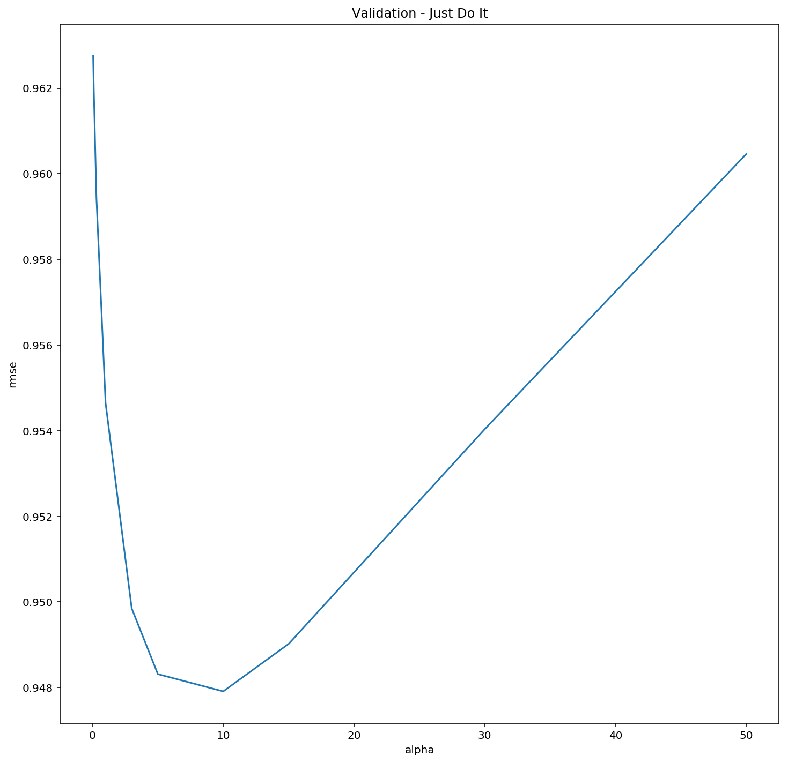
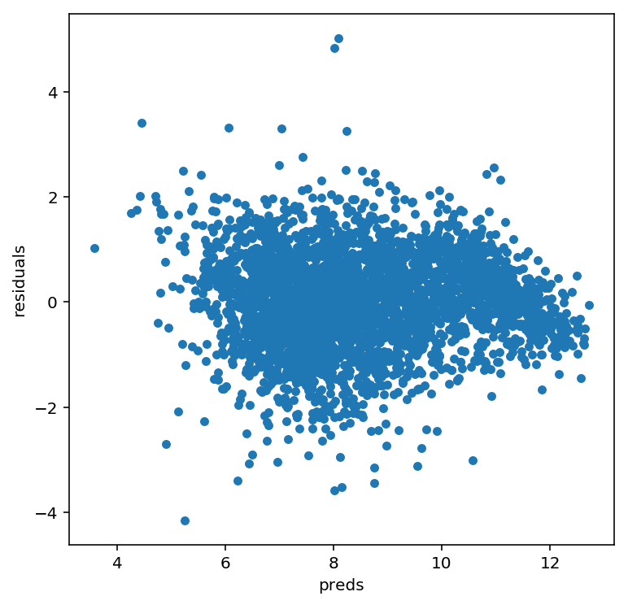

# Previsão de Votação de Deputados

### Sobre a tarefa

Nesta atividade construiremos modelos preditivos de regressão em scikit learn para a predição dos votos de deputados federais considerando as últimas eleições. As atividades esperadas para essa etapa são descritas a seguir:

1. Baixe os dados [aqui](https://canvas.instructure.com/courses/1389733/files/69523670/download?verifier=A5EPvssqIQCjlxpWQyesLFer1VDTlRyTAAXR2iyi&wrap=1) (veja descrição dos dados mais abaixo).
2. Considere o pipeline mostrado nesse [link](https://www.kaggle.com/apapiu/regularized-linear-models) para construir seus modelos de regressão. Isso implica, dentre outras coisas:
    - Analisar as distribuições das variáveis para ver se estão enviesadas e precisam de correção; tratamento de valores ausentes, variáveis categóricas e normalização, quando for o caso.   
    - Construir modelos de regressão com (ridge e lasso) e sem regularização.    
    - Considerar também modelos de regressão não paramétrica como K-NN.    
    - Considerar outros modelos ainda não vistos em sala de sua escolha (e.g. SVR, Regression Trees e Random Florests).    
    - Tunar os hiperâmetros para cada caso e retornar os rmses de validação cruzada para todos os modelos avaliados.    
    - Plotar os resíduos versus predições e analisar se esses plots representam bons indícios da adequabilidade dos modelos a esse problema.    
3. Alguns dias antes da entrega final serão liberados os dados de teste referentes à 2014 para validação final dos seus melhores modelos.
    - Dica: Uma coisa que você pode fazer é usar os dados de 2006 como treino e os de 2010 como validação. Uma vez encontrados os melhores modelos para 2010 junte 2006+2010, retreine, e aplique o modelo aos dados de 2014 que serão liberados.    
4. Responder:
    - Dentre os modelos avaliados, qual foi o que deu o melhor resultado nos dados de 2014 em termos de RMSE? Justifique bem sua resposta.
    
A entrega deve ser um notebook Jupyter com código python e texto explicativo quando necessário. Crie um repositório na sua conta do github e envie o link do html do notebook.

### Sobre os dados

Vamos explorar dados sobre as votações que candidatos à Câmara Federal de Deputados receberam nos anos de 2006 e 2010. Esses dados foram extraídos do [TSE](http://www.tse.jus.br/hotSites/pesquisas-eleitorais/index.html), pré-processados e contemplam informações sobre aproximadamente 7.300 candidatos. A descrição de cada atributo é dada mais abaixo.

|  Variável  | Tipo | Descrição |
|:------------|:------:|:-----------|
|"sequencial_candidato" | (character) | id do candidato|
|"nome"| (character) | |
|"uf" | (character) | |
|"partido" | (character)| |
|"quantidade_doacoes"| (integer)| |
|"quantidade_doadores"| (integer) | número de doadores diferentes|
|"total_receita" | (double) | soma em R\$ das doações |
|"media_receita" | (double) | média das doações |
|"recursos_de_outros_candidatos/comites" | (double) | quantia em R\$ das doações provenientes de outros candidatos ou comite partidário |
|"recursos_de_pessoas_fisicas" | (double) | quantia em R\$ das doações provenientes de outros CPFs |
|"recursos_de_pessoas_juridicas" | (double) | quantia em R\$ das doações provenientes de outros CNPJ |
|"recursos_proprios" | (double) | quantia em R\$ das doações provenientes do próprio candidato |
|"recursos_de_partido_politico" | (double) | quantia em R\$ das doações provenientes do partido político do candidato |
|**"votos"** | (integer) | **variável alvo**. Se refere ao número de votos na campanha de 2006 e 2010 |
|"quantidade_despesas" | (integer) | |
|"quantidade_fornecedores" | (integer) | número de fornecedores/despesas diferentes |
|"total_despesa" | (double) | soma em R$ das despesas de campanha |
|"media_despesa" | (double) | média das despesas de campanha |
|"cargo" |(character) | |
|"Sexo": | (character) | |
|"grau": | (character) | grau de instrução do candidato |
|"estado_civil" | (character) |
|"ocupacao" | (character) | ocupação do candidato |


```python
import pandas as pd
import numpy as np
import seaborn as sns
import matplotlib

import matplotlib.pyplot as plt
from scipy.stats import skew
from scipy.stats.stats import pearsonr

%config InlineBackend.figure_format = 'retina' #set 'png' here when working on notebook
%matplotlib inline
```


```python
# Carregando o dataset eleições
eleicoes2006a2010 = pd.read_csv('eleicoes_2006_a_2010.csv')
```


```python
# Visualizando as colunas do dataset
eleicoes2006a2010.columns
```


    Index(['ano', 'sequencial_candidato', 'nome', 'uf', 'partido',
           'quantidade_doacoes', 'quantidade_doadores', 'total_receita',
           'media_receita', 'recursos_de_outros_candidatos/comites',
           'recursos_de_pessoas_fisicas', 'recursos_de_pessoas_juridicas',
           'recursos_proprios', 'quantidade_despesas', 'quantidade_fornecedores',
           'total_despesa', 'media_despesa', 'cargo', 'sexo', 'grau',
           'estado_civil', 'ocupacao', 'votos'],
          dtype='object')


```python
# Separando os datasets para treino e teste
# Treino
eleicoes2006 = eleicoes2006a2010[eleicoes2006a2010['ano'] == 2006]
# Selecionando os atributos a serem utilizados no treino
train = eleicoes2006.loc[:,['sequencial_candidato', 'uf', 'partido',
       'quantidade_doacoes', 'quantidade_doadores', 'total_receita',
       'media_receita', 'recursos_de_outros_candidatos/comites',
       'recursos_de_pessoas_fisicas', 'recursos_de_pessoas_juridicas',
       'recursos_proprios', 'quantidade_despesas', 'quantidade_fornecedores',
       'total_despesa', 'media_despesa', 'cargo', 'sexo', 'grau',
       'estado_civil', 'ocupacao', 'votos']]
# Teste
eleicoes2010 = eleicoes2006a2010[eleicoes2006a2010['ano'] == 2010]
# Selecionando os atributos a serem utilizados no teste
test = eleicoes2010.loc[:,['sequencial_candidato','uf','partido',
       'quantidade_doacoes', 'quantidade_doadores', 'total_receita',
       'media_receita', 'recursos_de_outros_candidatos/comites',
       'recursos_de_pessoas_fisicas', 'recursos_de_pessoas_juridicas',
       'recursos_proprios', 'quantidade_despesas', 'quantidade_fornecedores',
       'total_despesa', 'media_despesa', 'cargo', 'sexo', 'grau',
       'estado_civil', 'ocupacao', 'votos']]
```


```python
train.head()
```


<div>
<style scoped>
    .dataframe tbody tr th:only-of-type {
        vertical-align: middle;
    }

    .dataframe tbody tr th {
        vertical-align: top;
    }

    .dataframe thead th {
        text-align: right;
    }
</style>
<table border="1" class="dataframe">
  <thead>
    <tr style="text-align: right;">
      <th></th>
      <th>sequencial_candidato</th>
      <th>uf</th>
      <th>partido</th>
      <th>quantidade_doacoes</th>
      <th>quantidade_doadores</th>
      <th>total_receita</th>
      <th>media_receita</th>
      <th>recursos_de_outros_candidatos/comites</th>
      <th>recursos_de_pessoas_fisicas</th>
      <th>recursos_de_pessoas_juridicas</th>
      <th>...</th>
      <th>quantidade_despesas</th>
      <th>quantidade_fornecedores</th>
      <th>total_despesa</th>
      <th>media_despesa</th>
      <th>cargo</th>
      <th>sexo</th>
      <th>grau</th>
      <th>estado_civil</th>
      <th>ocupacao</th>
      <th>votos</th>
    </tr>
  </thead>
  <tbody>
    <tr>
      <th>0</th>
      <td>10001</td>
      <td>AP</td>
      <td>PT</td>
      <td>6</td>
      <td>6</td>
      <td>16600.00</td>
      <td>2766.666667</td>
      <td>NaN</td>
      <td>9000.0</td>
      <td>6300.00</td>
      <td>...</td>
      <td>14</td>
      <td>14</td>
      <td>16583.60</td>
      <td>1184.542857</td>
      <td>DEPUTADO FEDERAL</td>
      <td>MASCULINO</td>
      <td>ENSINO MÉDIO COMPLETO</td>
      <td>CASADO(A)</td>
      <td>VEREADOR</td>
      <td>8579</td>
    </tr>
    <tr>
      <th>1</th>
      <td>10002</td>
      <td>RO</td>
      <td>PT</td>
      <td>13</td>
      <td>13</td>
      <td>22826.00</td>
      <td>1755.846154</td>
      <td>6625.0</td>
      <td>15000.0</td>
      <td>1000.00</td>
      <td>...</td>
      <td>24</td>
      <td>23</td>
      <td>20325.99</td>
      <td>883.738696</td>
      <td>DEPUTADO FEDERAL</td>
      <td>FEMININO</td>
      <td>SUPERIOR COMPLETO</td>
      <td>SOLTEIRO(A)</td>
      <td>SERVIDOR PÚBLICO ESTADUAL</td>
      <td>2757</td>
    </tr>
    <tr>
      <th>2</th>
      <td>10002</td>
      <td>AP</td>
      <td>PT</td>
      <td>17</td>
      <td>16</td>
      <td>148120.80</td>
      <td>9257.550000</td>
      <td>2250.0</td>
      <td>34150.0</td>
      <td>62220.80</td>
      <td>...</td>
      <td>123</td>
      <td>108</td>
      <td>146011.70</td>
      <td>1351.960185</td>
      <td>DEPUTADO FEDERAL</td>
      <td>FEMININO</td>
      <td>SUPERIOR COMPLETO</td>
      <td>VIÚVO(A)</td>
      <td>PEDAGOGO</td>
      <td>17428</td>
    </tr>
    <tr>
      <th>3</th>
      <td>10002</td>
      <td>MS</td>
      <td>PRONA</td>
      <td>6</td>
      <td>6</td>
      <td>3001.12</td>
      <td>500.186667</td>
      <td>NaN</td>
      <td>1150.0</td>
      <td>1101.12</td>
      <td>...</td>
      <td>8</td>
      <td>8</td>
      <td>3001.12</td>
      <td>375.140000</td>
      <td>DEPUTADO FEDERAL</td>
      <td>MASCULINO</td>
      <td>ENSINO MÉDIO INCOMPLETO</td>
      <td>CASADO(A)</td>
      <td>MILITAR REFORMADO</td>
      <td>1193</td>
    </tr>
    <tr>
      <th>4</th>
      <td>10003</td>
      <td>RO</td>
      <td>PT</td>
      <td>48</td>
      <td>48</td>
      <td>NaN</td>
      <td>NaN</td>
      <td>NaN</td>
      <td>50878.0</td>
      <td>NaN</td>
      <td>...</td>
      <td>133</td>
      <td>120</td>
      <td>116416.64</td>
      <td>970.138667</td>
      <td>DEPUTADO FEDERAL</td>
      <td>MASCULINO</td>
      <td>ENSINO FUNDAMENTAL COMPLETO</td>
      <td>CASADO(A)</td>
      <td>DEPUTADO</td>
      <td>29401</td>
    </tr>
  </tbody>
</table>
<p>5 rows × 21 columns</p>
</div>


```python
# Concatenando os preditores dos datasets de treino e teste
all_data = pd.concat((train.loc[:,'uf':'ocupacao'],
                      test.loc[:,'uf':'ocupacao']))
```


```python
all_data.head()
```


<div>
<style scoped>
    .dataframe tbody tr th:only-of-type {
        vertical-align: middle;
    }

    .dataframe tbody tr th {
        vertical-align: top;
    }

    .dataframe thead th {
        text-align: right;
    }
</style>
<table border="1" class="dataframe">
  <thead>
    <tr style="text-align: right;">
      <th></th>
      <th>uf</th>
      <th>partido</th>
      <th>quantidade_doacoes</th>
      <th>quantidade_doadores</th>
      <th>total_receita</th>
      <th>media_receita</th>
      <th>recursos_de_outros_candidatos/comites</th>
      <th>recursos_de_pessoas_fisicas</th>
      <th>recursos_de_pessoas_juridicas</th>
      <th>recursos_proprios</th>
      <th>quantidade_despesas</th>
      <th>quantidade_fornecedores</th>
      <th>total_despesa</th>
      <th>media_despesa</th>
      <th>cargo</th>
      <th>sexo</th>
      <th>grau</th>
      <th>estado_civil</th>
      <th>ocupacao</th>
    </tr>
  </thead>
  <tbody>
    <tr>
      <th>0</th>
      <td>AP</td>
      <td>PT</td>
      <td>6</td>
      <td>6</td>
      <td>16600.00</td>
      <td>2766.666667</td>
      <td>NaN</td>
      <td>9000.0</td>
      <td>6300.00</td>
      <td>1300.0</td>
      <td>14</td>
      <td>14</td>
      <td>16583.60</td>
      <td>1184.542857</td>
      <td>DEPUTADO FEDERAL</td>
      <td>MASCULINO</td>
      <td>ENSINO MÉDIO COMPLETO</td>
      <td>CASADO(A)</td>
      <td>VEREADOR</td>
    </tr>
    <tr>
      <th>1</th>
      <td>RO</td>
      <td>PT</td>
      <td>13</td>
      <td>13</td>
      <td>22826.00</td>
      <td>1755.846154</td>
      <td>6625.0</td>
      <td>15000.0</td>
      <td>1000.00</td>
      <td>201.0</td>
      <td>24</td>
      <td>23</td>
      <td>20325.99</td>
      <td>883.738696</td>
      <td>DEPUTADO FEDERAL</td>
      <td>FEMININO</td>
      <td>SUPERIOR COMPLETO</td>
      <td>SOLTEIRO(A)</td>
      <td>SERVIDOR PÚBLICO ESTADUAL</td>
    </tr>
    <tr>
      <th>2</th>
      <td>AP</td>
      <td>PT</td>
      <td>17</td>
      <td>16</td>
      <td>148120.80</td>
      <td>9257.550000</td>
      <td>2250.0</td>
      <td>34150.0</td>
      <td>62220.80</td>
      <td>59500.0</td>
      <td>123</td>
      <td>108</td>
      <td>146011.70</td>
      <td>1351.960185</td>
      <td>DEPUTADO FEDERAL</td>
      <td>FEMININO</td>
      <td>SUPERIOR COMPLETO</td>
      <td>VIÚVO(A)</td>
      <td>PEDAGOGO</td>
    </tr>
    <tr>
      <th>3</th>
      <td>MS</td>
      <td>PRONA</td>
      <td>6</td>
      <td>6</td>
      <td>3001.12</td>
      <td>500.186667</td>
      <td>NaN</td>
      <td>1150.0</td>
      <td>1101.12</td>
      <td>750.0</td>
      <td>8</td>
      <td>8</td>
      <td>3001.12</td>
      <td>375.140000</td>
      <td>DEPUTADO FEDERAL</td>
      <td>MASCULINO</td>
      <td>ENSINO MÉDIO INCOMPLETO</td>
      <td>CASADO(A)</td>
      <td>MILITAR REFORMADO</td>
    </tr>
    <tr>
      <th>4</th>
      <td>RO</td>
      <td>PT</td>
      <td>48</td>
      <td>48</td>
      <td>NaN</td>
      <td>NaN</td>
      <td>NaN</td>
      <td>50878.0</td>
      <td>NaN</td>
      <td>68942.0</td>
      <td>133</td>
      <td>120</td>
      <td>116416.64</td>
      <td>970.138667</td>
      <td>DEPUTADO FEDERAL</td>
      <td>MASCULINO</td>
      <td>ENSINO FUNDAMENTAL COMPLETO</td>
      <td>CASADO(A)</td>
      <td>DEPUTADO</td>
    </tr>
  </tbody>
</table>
</div>


## Pré-processamento dos dados


```python
# Verificando quais transformação normaliza os dados
matplotlib.rcParams['figure.figsize'] = (12.0, 12.0)
votos = pd.DataFrame({"Votos":train["votos"], "log(Votos)":np.log(train["votos"]), \
                       "sqrt(Votos)":np.sqrt(train["votos"]),"square(Votos)":np.square(train["votos"]), \
                     "module(Votos)":np.abs(train["votos"]), "inv(Votos)":(-1/train["votos"])})
votos.hist()
plt.show()
```


A maioria dos algoritmos de aprendizado de máquina funciona melhor se os recursos tiverem uma distribuição normal. 


```python
#log transform the target:
train["votos"] = np.log1p(train["votos"])

#log transform skewed numeric features:
numeric_feats = all_data.dtypes[all_data.dtypes != "object"].index

skewed_feats = train[numeric_feats].apply(lambda x: skew(x.dropna())) #compute skewness
skewed_feats = skewed_feats[skewed_feats > 0.75]
skewed_feats = skewed_feats.index

all_data[skewed_feats] = np.log1p(all_data[skewed_feats])
```


```python
all_data = pd.get_dummies(all_data)
```


```python
#filling NA's with the mean of the column:
all_data = all_data.fillna(all_data.mean())
```


```python
#creating matrices for sklearn:
X_train = all_data[:train.shape[0]]
X_test = all_data[train.shape[0]:]
y = train.votos
```


```python
X_train.head()
```


<div>
<style scoped>
    .dataframe tbody tr th:only-of-type {
        vertical-align: middle;
    }

    .dataframe tbody tr th {
        vertical-align: top;
    }

    .dataframe thead th {
        text-align: right;
    }
</style>
<table border="1" class="dataframe">
  <thead>
    <tr style="text-align: right;">
      <th></th>
      <th>quantidade_doacoes</th>
      <th>quantidade_doadores</th>
      <th>total_receita</th>
      <th>media_receita</th>
      <th>recursos_de_outros_candidatos/comites</th>
      <th>recursos_de_pessoas_fisicas</th>
      <th>recursos_de_pessoas_juridicas</th>
      <th>recursos_proprios</th>
      <th>quantidade_despesas</th>
      <th>quantidade_fornecedores</th>
      <th>...</th>
      <th>ocupacao_TÉCNICO DE OBRAS CIVIS, ESTRADAS, SANEAMENTO E ASSEMELHADOS</th>
      <th>ocupacao_TÉCNICO EM AGRONOMIA E AGRIMENSURA</th>
      <th>ocupacao_TÉCNICO EM EDIFICAÇÕES</th>
      <th>ocupacao_TÉCNICO EM INFORMÁTICA</th>
      <th>ocupacao_VENDEDOR DE COMÉRCIO VAREJISTA E ATACADISTA</th>
      <th>ocupacao_VENDEDOR PRACISTA, REPRESENTANTE, CAIXEIRO-VIAJANTE E ASSEMELHADOS</th>
      <th>ocupacao_VEREADOR</th>
      <th>ocupacao_VETERINÁRIO</th>
      <th>ocupacao_VIGILANTE</th>
      <th>ocupacao_ZOOTECNISTA</th>
    </tr>
  </thead>
  <tbody>
    <tr>
      <th>0</th>
      <td>1.945910</td>
      <td>1.945910</td>
      <td>9.717218</td>
      <td>7.925760</td>
      <td>8.324939</td>
      <td>9.105091</td>
      <td>8.748464</td>
      <td>7.170888</td>
      <td>2.708050</td>
      <td>2.708050</td>
      <td>...</td>
      <td>0</td>
      <td>0</td>
      <td>0</td>
      <td>0</td>
      <td>0</td>
      <td>0</td>
      <td>1</td>
      <td>0</td>
      <td>0</td>
      <td>0</td>
    </tr>
    <tr>
      <th>1</th>
      <td>2.639057</td>
      <td>2.639057</td>
      <td>10.035699</td>
      <td>7.471276</td>
      <td>8.798757</td>
      <td>9.615872</td>
      <td>6.908755</td>
      <td>5.308268</td>
      <td>3.218876</td>
      <td>3.178054</td>
      <td>...</td>
      <td>0</td>
      <td>0</td>
      <td>0</td>
      <td>0</td>
      <td>0</td>
      <td>0</td>
      <td>0</td>
      <td>0</td>
      <td>0</td>
      <td>0</td>
    </tr>
    <tr>
      <th>2</th>
      <td>2.890372</td>
      <td>2.833213</td>
      <td>11.905790</td>
      <td>9.133303</td>
      <td>7.719130</td>
      <td>10.438547</td>
      <td>11.038461</td>
      <td>10.993748</td>
      <td>4.820282</td>
      <td>4.691348</td>
      <td>...</td>
      <td>0</td>
      <td>0</td>
      <td>0</td>
      <td>0</td>
      <td>0</td>
      <td>0</td>
      <td>0</td>
      <td>0</td>
      <td>0</td>
      <td>0</td>
    </tr>
    <tr>
      <th>3</th>
      <td>1.945910</td>
      <td>1.945910</td>
      <td>8.007074</td>
      <td>6.216979</td>
      <td>8.324939</td>
      <td>7.048386</td>
      <td>7.004991</td>
      <td>6.621406</td>
      <td>2.197225</td>
      <td>2.197225</td>
      <td>...</td>
      <td>0</td>
      <td>0</td>
      <td>0</td>
      <td>0</td>
      <td>0</td>
      <td>0</td>
      <td>0</td>
      <td>0</td>
      <td>0</td>
      <td>0</td>
    </tr>
    <tr>
      <th>4</th>
      <td>3.891820</td>
      <td>3.891820</td>
      <td>9.634619</td>
      <td>7.466020</td>
      <td>8.324939</td>
      <td>10.837206</td>
      <td>10.011960</td>
      <td>11.141035</td>
      <td>4.897840</td>
      <td>4.795791</td>
      <td>...</td>
      <td>0</td>
      <td>0</td>
      <td>0</td>
      <td>0</td>
      <td>0</td>
      <td>0</td>
      <td>0</td>
      <td>0</td>
      <td>0</td>
      <td>0</td>
    </tr>
  </tbody>
</table>
<p>5 rows × 260 columns</p>
</div>


```python
X_test.head()
```


<div>
<style scoped>
    .dataframe tbody tr th:only-of-type {
        vertical-align: middle;
    }

    .dataframe tbody tr th {
        vertical-align: top;
    }

    .dataframe thead th {
        text-align: right;
    }
</style>
<table border="1" class="dataframe">
  <thead>
    <tr style="text-align: right;">
      <th></th>
      <th>quantidade_doacoes</th>
      <th>quantidade_doadores</th>
      <th>total_receita</th>
      <th>media_receita</th>
      <th>recursos_de_outros_candidatos/comites</th>
      <th>recursos_de_pessoas_fisicas</th>
      <th>recursos_de_pessoas_juridicas</th>
      <th>recursos_proprios</th>
      <th>quantidade_despesas</th>
      <th>quantidade_fornecedores</th>
      <th>...</th>
      <th>ocupacao_TÉCNICO DE OBRAS CIVIS, ESTRADAS, SANEAMENTO E ASSEMELHADOS</th>
      <th>ocupacao_TÉCNICO EM AGRONOMIA E AGRIMENSURA</th>
      <th>ocupacao_TÉCNICO EM EDIFICAÇÕES</th>
      <th>ocupacao_TÉCNICO EM INFORMÁTICA</th>
      <th>ocupacao_VENDEDOR DE COMÉRCIO VAREJISTA E ATACADISTA</th>
      <th>ocupacao_VENDEDOR PRACISTA, REPRESENTANTE, CAIXEIRO-VIAJANTE E ASSEMELHADOS</th>
      <th>ocupacao_VEREADOR</th>
      <th>ocupacao_VETERINÁRIO</th>
      <th>ocupacao_VIGILANTE</th>
      <th>ocupacao_ZOOTECNISTA</th>
    </tr>
  </thead>
  <tbody>
    <tr>
      <th>3388</th>
      <td>3.610918</td>
      <td>3.583519</td>
      <td>12.916305</td>
      <td>9.361041</td>
      <td>12.503138</td>
      <td>10.975944</td>
      <td>8.926358</td>
      <td>11.463068</td>
      <td>4.007333</td>
      <td>3.891820</td>
      <td>...</td>
      <td>0</td>
      <td>0</td>
      <td>0</td>
      <td>0</td>
      <td>0</td>
      <td>0</td>
      <td>0</td>
      <td>0</td>
      <td>0</td>
      <td>0</td>
    </tr>
    <tr>
      <th>3389</th>
      <td>1.386294</td>
      <td>1.386294</td>
      <td>8.852379</td>
      <td>7.754053</td>
      <td>8.324939</td>
      <td>8.984406</td>
      <td>8.610866</td>
      <td>7.313887</td>
      <td>1.386294</td>
      <td>1.386294</td>
      <td>...</td>
      <td>0</td>
      <td>0</td>
      <td>0</td>
      <td>0</td>
      <td>0</td>
      <td>0</td>
      <td>0</td>
      <td>0</td>
      <td>0</td>
      <td>0</td>
    </tr>
    <tr>
      <th>3390</th>
      <td>1.386294</td>
      <td>1.386294</td>
      <td>7.518064</td>
      <td>6.420538</td>
      <td>5.673323</td>
      <td>7.313887</td>
      <td>10.011960</td>
      <td>3.931826</td>
      <td>1.386294</td>
      <td>1.386294</td>
      <td>...</td>
      <td>0</td>
      <td>0</td>
      <td>0</td>
      <td>0</td>
      <td>0</td>
      <td>0</td>
      <td>0</td>
      <td>0</td>
      <td>0</td>
      <td>0</td>
    </tr>
    <tr>
      <th>3391</th>
      <td>0.693147</td>
      <td>0.693147</td>
      <td>6.089045</td>
      <td>6.089045</td>
      <td>6.089045</td>
      <td>8.984406</td>
      <td>10.011960</td>
      <td>8.431020</td>
      <td>0.693147</td>
      <td>0.693147</td>
      <td>...</td>
      <td>0</td>
      <td>0</td>
      <td>0</td>
      <td>0</td>
      <td>0</td>
      <td>0</td>
      <td>0</td>
      <td>0</td>
      <td>0</td>
      <td>0</td>
    </tr>
    <tr>
      <th>3392</th>
      <td>2.772589</td>
      <td>2.639057</td>
      <td>12.394629</td>
      <td>9.829729</td>
      <td>8.324939</td>
      <td>8.716208</td>
      <td>11.100451</td>
      <td>9.296610</td>
      <td>4.430817</td>
      <td>4.094345</td>
      <td>...</td>
      <td>0</td>
      <td>0</td>
      <td>0</td>
      <td>0</td>
      <td>0</td>
      <td>0</td>
      <td>0</td>
      <td>0</td>
      <td>0</td>
      <td>0</td>
    </tr>
  </tbody>
</table>
<p>5 rows × 260 columns</p>
</div>


### Modelos

Agora vamos usar modelos de regressão lineares utilizando o módulo de aprendizado do scikit.

#### Regressão linear sem regularização


```python
from sklearn.linear_model import LinearRegression
```


```python
lm = LinearRegression()
```


```python
lm.fit(X_train,y)
```


    LinearRegression(copy_X=True, fit_intercept=True, n_jobs=1, normalize=False)


```python
# Printando a intercepção
print(lm.intercept_)
```

    18905221901.87302


```python
# Coeficente da regressão sem regularização
coef_df = pd.DataFrame(lm.coef_,X_train.columns,columns=['Coefficient'])
coef_df.head(10)
```


<div>
<style scoped>
    .dataframe tbody tr th:only-of-type {
        vertical-align: middle;
    }

    .dataframe tbody tr th {
        vertical-align: top;
    }

    .dataframe thead th {
        text-align: right;
    }
</style>
<table border="1" class="dataframe">
  <thead>
    <tr style="text-align: right;">
      <th></th>
      <th>Coefficient</th>
    </tr>
  </thead>
  <tbody>
    <tr>
      <th>quantidade_doacoes</th>
      <td>-0.296077</td>
    </tr>
    <tr>
      <th>quantidade_doadores</th>
      <td>0.661785</td>
    </tr>
    <tr>
      <th>total_receita</th>
      <td>0.047585</td>
    </tr>
    <tr>
      <th>media_receita</th>
      <td>0.131120</td>
    </tr>
    <tr>
      <th>recursos_de_outros_candidatos/comites</th>
      <td>0.048504</td>
    </tr>
    <tr>
      <th>recursos_de_pessoas_fisicas</th>
      <td>0.030387</td>
    </tr>
    <tr>
      <th>recursos_de_pessoas_juridicas</th>
      <td>0.029640</td>
    </tr>
    <tr>
      <th>recursos_proprios</th>
      <td>-0.006116</td>
    </tr>
    <tr>
      <th>quantidade_despesas</th>
      <td>0.077707</td>
    </tr>
    <tr>
      <th>quantidade_fornecedores</th>
      <td>1.120890</td>
    </tr>
  </tbody>
</table>
</div>


```python
from sklearn import metrics
#print('MAE:', metrics.mean_absolute_error(y, predictions))
#print('MSE:', metrics.mean_squared_error(y, predictions))
#print('RMSE:', np.sqrt(metrics.mean_squared_error(y, predictions)))
```

#### Regressão linear com regularização


```python
from sklearn.linear_model import Ridge, RidgeCV, ElasticNet, LassoCV, LassoLarsCV
from sklearn.model_selection import cross_val_score

def rmse_cv(model):
    rmse= np.sqrt(-cross_val_score(model, X_train, y, scoring="neg_mean_squared_error", cv = 5))
    return(rmse)
```

#### Regressão linear com regularização Ridge


```python
model_ridge = Ridge()
```


```python
model_ridge.fit(X_train,y)
```


    Ridge(alpha=1.0, copy_X=True, fit_intercept=True, max_iter=None,
       normalize=False, random_state=None, solver='auto', tol=0.001)


```python
# Printando a intercepção
print(model_ridge.intercept_)
```

    1.6371261652898816


```python
# Coeficente da regressão com regularização ridge
coef_ridge = pd.DataFrame(model_ridge.coef_,X_train.columns,columns=['Coefficient'])
coef_ridge.head(10)
```


<div>
<style scoped>
    .dataframe tbody tr th:only-of-type {
        vertical-align: middle;
    }

    .dataframe tbody tr th {
        vertical-align: top;
    }

    .dataframe thead th {
        text-align: right;
    }
</style>
<table border="1" class="dataframe">
  <thead>
    <tr style="text-align: right;">
      <th></th>
      <th>Coefficient</th>
    </tr>
  </thead>
  <tbody>
    <tr>
      <th>quantidade_doacoes</th>
      <td>-0.275906</td>
    </tr>
    <tr>
      <th>quantidade_doadores</th>
      <td>0.646945</td>
    </tr>
    <tr>
      <th>total_receita</th>
      <td>0.043865</td>
    </tr>
    <tr>
      <th>media_receita</th>
      <td>0.134765</td>
    </tr>
    <tr>
      <th>recursos_de_outros_candidatos/comites</th>
      <td>0.049364</td>
    </tr>
    <tr>
      <th>recursos_de_pessoas_fisicas</th>
      <td>0.031614</td>
    </tr>
    <tr>
      <th>recursos_de_pessoas_juridicas</th>
      <td>0.031818</td>
    </tr>
    <tr>
      <th>recursos_proprios</th>
      <td>-0.005446</td>
    </tr>
    <tr>
      <th>quantidade_despesas</th>
      <td>0.067061</td>
    </tr>
    <tr>
      <th>quantidade_fornecedores</th>
      <td>1.049819</td>
    </tr>
  </tbody>
</table>
</div>


O principal parâmetro de ajuste para o modelo Ridge é alpha - um parâmetro de regularização que mede quão flexível é nosso modelo. Quanto maior a regularização, menos propenso será o nosso modelo de overfit. No entanto, também perderá a flexibilidade e poderá não capturar todo o sinal nos dados.


```python
alphas = [0.05, 0.1, 0.3, 1, 3, 5, 10, 15, 30, 50]
cv_ridge = [rmse_cv(Ridge(alpha = alpha)).mean() 
            for alpha in alphas]
```


```python
cv_ridge = pd.Series(cv_ridge, index = alphas)
cv_ridge.plot(title = "Validation - Just Do It")
plt.xlabel("alpha")
plt.ylabel("rmse")
```


    Text(0,0.5,'rmse')





```python
cv_ridge.min()
```


    0.9479115249847114


```python
model_lasso = LassoCV(alphas = [1, 0.1, 0.001, 0.0005], max_iter=10000).fit(X_train, y)
```


```python
rmse_cv(model_lasso).mean()
```


    0.9501097590701928


```python
# Printando a intercepção
print(model_lasso.intercept_)
```

    1.8004518439331516


```python
# Coeficientes da regressão com regularização lasso
coef_lasso = pd.DataFrame(model_lasso.coef_, index = X_train.columns, columns=['Coefficient'])
coef_lasso.head(10)
```


<div>
<style scoped>
    .dataframe tbody tr th:only-of-type {
        vertical-align: middle;
    }

    .dataframe tbody tr th {
        vertical-align: top;
    }

    .dataframe thead th {
        text-align: right;
    }
</style>
<table border="1" class="dataframe">
  <thead>
    <tr style="text-align: right;">
      <th></th>
      <th>Coefficient</th>
    </tr>
  </thead>
  <tbody>
    <tr>
      <th>quantidade_doacoes</th>
      <td>-0.110261</td>
    </tr>
    <tr>
      <th>quantidade_doadores</th>
      <td>0.501697</td>
    </tr>
    <tr>
      <th>total_receita</th>
      <td>0.034032</td>
    </tr>
    <tr>
      <th>media_receita</th>
      <td>0.143505</td>
    </tr>
    <tr>
      <th>recursos_de_outros_candidatos/comites</th>
      <td>0.049294</td>
    </tr>
    <tr>
      <th>recursos_de_pessoas_fisicas</th>
      <td>0.035483</td>
    </tr>
    <tr>
      <th>recursos_de_pessoas_juridicas</th>
      <td>0.038919</td>
    </tr>
    <tr>
      <th>recursos_proprios</th>
      <td>-0.003388</td>
    </tr>
    <tr>
      <th>quantidade_despesas</th>
      <td>0.000000</td>
    </tr>
    <tr>
      <th>quantidade_fornecedores</th>
      <td>0.824905</td>
    </tr>
  </tbody>
</table>
</div>


```python
coef_lasso = pd.Series(model_lasso.coef_, index = X_train.columns)
```


```python
print("O Lasso selecionou " + str(sum(coef_lasso != 0)) + " variaveis e eliminou outras " +  str(sum(coef_lasso == 0)) + " variables")
```

    O Lasso selecionou 103 variaveis e eliminou outras 157 variables


```python
imp_coef_lasso = pd.concat([coef_lasso.sort_values().head(10),
                     coef_lasso.sort_values().tail(10)])
```

Podemos perceber pela visualização acima que o atributo mais importante é `quantidade_fornecedores` seguido da `media_despesa` e ter a ocupação deputado.


```python
#Vendo os resíduos
matplotlib.rcParams['figure.figsize'] = (6.0, 6.0)

preds = pd.DataFrame({"preds":model_lasso.predict(X_train), "true":y})
preds["residuals"] = preds["true"] - preds["preds"]
preds.plot(x = "preds", y = "residuals",kind = "scatter")
plt.show()
```




